<!-- Source: app/page.mdx -->
# AppDispatch

**Continuous delivery for Expo & React Native.**

Most mobile teams use three separate tools to ship safely: one for OTA updates, one for feature flags, and one for crash monitoring. When something breaks, you're left stitching together dashboards to figure out if it was the deploy or the flag. AppDispatch replaces all three with one platform — so deploying code, enabling features, measuring impact, and rolling back are a single workflow, not a juggling act.

```jsx
import { useBooleanFlagValue } from '@appdispatch/react-native'

function CheckoutButton() {
  const newCheckout = useBooleanFlagValue('new-checkout', false)

  return newCheckout ? <NewCheckoutFlow /> : <LegacyCheckout />
}
```

Toggle `new-checkout` from the dashboard. Your app updates instantly — no deploy required.

---

## Get started in 5 minutes

import { Cards } from 'nextra/components'

<Cards>
  <Cards.Card title="Quickstart" href="/getting-started" />
  <Cards.Card title="Core Concepts" href="/concepts" />
  <Cards.Card title="OTA Releases" href="/updates" />
  <Cards.Card title="Feature Flags" href="/feature-flags" />
</Cards>

## One system, not three

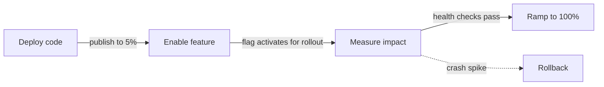

With separate tools, each step is a manual handoff. With AppDispatch, they're wired together:

1. **Deploy code** — Push a release to a percentage of devices with `dispatch publish`
2. **Enable feature** — Linked flags activate only for devices that received the release
3. **Measure impact** — Crash rate and error rate are tracked per flag variation and release version automatically
4. **Ramp or rollback** — Rollout policies advance through stages when health thresholds pass. If metrics degrade, roll back a single flag, the entire release, or a whole channel.

Because AppDispatch owns the update pipeline, the flag evaluation, and the error collection, it knows which devices have which code **and** which flag state. That's what makes [cross-dimensional telemetry](/insights) possible — and why rollback can be surgical instead of all-or-nothing.

## The platform

- **OTA releases** — Push JavaScript bundles without app store review
- **Feature flags** — Toggle features per environment with [OpenFeature](https://openfeature.dev), evaluated on-device with no network calls
- **Linked flags** — Tie flag state to a release so features activate only for devices that have the code
- **Rollout policies** — Automate progressive deployments with health-based stage gates and auto-rollback
- **Channels & branches** — Route releases to production, staging, or any environment
- **Code-aware targeting** — Flag rules that reference runtime versions, so flags can't activate without the code
- **Graduated rollback** — Revert a single flag, an entire release, or a whole channel
- **Cross-dimensional telemetry** — Correlate crash spikes with specific flag variations and release versions automatically

---

<!-- Source: app/getting-started/page.mdx -->
# Quickstart

Get from zero to shipping OTA updates in under 5 minutes.

## Prerequisites

- An Expo or React Native project
- An AppDispatch account and API key (Settings → API Keys in the dashboard)

## 1. Install the CLI

See the [CLI reference](/cli) for platform-specific binaries, or on macOS:

```bash
curl -sL https://github.com/AppDispatch/cli/releases/latest/download/dispatch-darwin-arm64 \
  -o /usr/local/bin/dispatch && chmod +x /usr/local/bin/dispatch
```

## 2. Log in

```bash
dispatch login --server https://api.appdispatch.com --key YOUR_API_KEY
```

## 3. Initialize your project

From your Expo project root:

```bash
dispatch init
```

Select your project, and the CLI will configure `app.json` automatically.

## 4. Install the SDK

```bash npm2yarn
npm install @appdispatch/react-native
```

## 5. Set up your app

Add the SDK to your root layout. `AppDispatch.init()` configures everything — OTA updates, feature flags, and health reporting — in one call:

```jsx filename="app/_layout.tsx"
import {
  AppDispatch,
  AppDispatchProvider,
  useOTAUpdates,
} from '@appdispatch/react-native'

AppDispatch.init({
  baseUrl: 'https://api.appdispatch.com',
  projectSlug: 'my-app',
  apiKey: 'YOUR_API_KEY',
  channel: 'production',
})

export default function RootLayout() {
  useOTAUpdates()

  return (
    <AppDispatchProvider>
      <YourApp />
    </AppDispatchProvider>
  )
}
```

- `AppDispatch.init()` — Initializes the OpenFeature provider and health reporter at module level
- `useOTAUpdates()` — Checks for updates on launch, generates a stable device ID for rollout bucketing, and applies critical updates immediately. No-ops in `__DEV__` mode.
- `AppDispatchProvider` — Wraps your app with the OpenFeature context and starts health monitoring

## 6. Publish your first release

```bash
dispatch publish -m "Initial release"
```

## 7. Verify

Open your app on a device or simulator. On the next launch, `expo-updates` will fetch the new bundle from AppDispatch and apply it.

## What just happened?

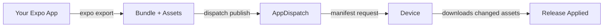

1. `dispatch publish` exported your app and uploaded the bundle
2. Your device's `useOTAUpdates` hook checked for a new manifest
3. Changed assets were downloaded and applied
4. On next launch, the new code runs

## Next steps

- [Set up your first feature flag](/getting-started/first-flag)
- [Learn about channels and branches](/updates/channels)
- [Explore the SDK](/feature-flags/sdk)

---

<!-- Source: app/getting-started/first-flag/page.mdx -->
# First Feature Flag

Ship a feature flag in under 5 minutes. This guide assumes you've completed the [Quickstart](/getting-started) and have `@appdispatch/react-native` installed.

## 1. Create a flag in the dashboard

Open **Flags** in the sidebar and click **Create flag**.

- **Name**: `New Checkout`
- **Key**: `new-checkout`
- **Type**: Boolean
- **Default value**: `false`

Click create, then toggle the flag **on** for your production channel.

## 2. Use the flag

```jsx
import { useBooleanFlagValue } from '@appdispatch/react-native'

function CheckoutButton() {
  const newCheckout = useBooleanFlagValue('new-checkout', false)

  if (newCheckout) {
    return <NewCheckoutFlow />
  }
  return <LegacyCheckout />
}
```

No additional setup needed — the SDK was already initialized in your root layout during the [Quickstart](/getting-started).

## 3. Toggle it

Go back to the dashboard, toggle the flag off. Reload your app — the old checkout appears.

Toggle it on — the new checkout appears. No deploy needed.

## Next steps

- [Add targeting rules](/feature-flags#targeting-rules) to roll out to a percentage of users
- [Create segments](/feature-flags/segments) for reusable audience targeting
- [Configure per-environment settings](/feature-flags#per-environment-settings) to test in staging first
- [Learn how the OpenFeature provider works](/feature-flags/openfeature)

---

<!-- Source: app/concepts/page.mdx -->
# Core Concepts

AppDispatch has nine core primitives that work together to deliver OTA releases, control feature visibility, and automate progressive deployments. This page explains each one and how they relate — read it once to build a mental model before diving into the feature-specific docs.

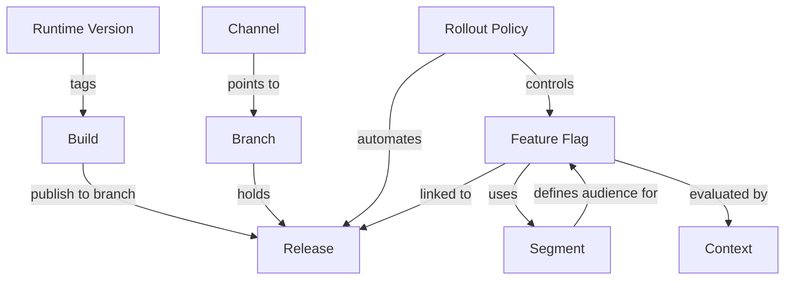

## Runtime Version

A runtime version is a fingerprint derived from your app's native dependencies. It determines OTA compatibility — AppDispatch only delivers releases to devices whose runtime version matches the release. When your native code changes (new native module, SDK upgrade, Expo config change), the runtime version changes and devices need an app store update before they can receive new OTA releases.

Runtime versions ensure that a JavaScript bundle is never delivered to a device running incompatible native code.

[Learn more about runtime versions](/updates#runtime-versions)

## Builds

A build is a compiled JavaScript bundle and its assets, uploaded to AppDispatch. Builds are not yet visible to devices — think of a build as a staging area. You upload builds via the CLI (`dispatch publish`) or CI/CD pipeline, and they sit in the builds list until you publish them to a channel.

Each build is tagged with a platform (iOS or Android), a runtime version, git metadata, and a unique identifier.

[Learn more about the build and publish workflow](/updates#publishing)

## Releases

A release is a published build delivered to devices via a channel. The relationship is: **build → publish → release**. Once a build is published, it becomes a release that devices can download.

Each release has per-release controls: a rollout percentage (0–100%) controlling what fraction of devices receive it, a critical flag that forces immediate application instead of waiting for the next cold start, and an enabled toggle that can pull a release from circulation without a full rollback.

[Learn more about releases](/updates)

## Branches

A branch is a named stream of releases. When you publish a build, it lands on a branch. Branches are the organizational layer between releases and channels — they group releases into a linear sequence that channels can point to.

Multiple channels can point to the same branch, which lets you "promote" releases by repointing a channel rather than re-publishing.

[Learn more about branches](/updates/channels)

## Channels

A channel is what devices connect to. Your app's configuration specifies a channel name (e.g., `production`, `staging`), and each channel points to a branch. The indirection is: **channel → branch → releases**. This means you can swap which branch a channel serves without touching device configuration.

Channels also support rollout branches — serve a percentage of devices from a different branch for canary deployments. Rollout bucketing is deterministic, so a given device always lands in the same bucket across launches.

[Learn more about channels](/updates/channels)

## Feature Flags

Feature flags let you toggle features without deploying new code. Flags are evaluated on-device using the OpenFeature standard — definitions are fetched once on app launch and cached locally, so evaluations are instant with no per-call network overhead.

Flags support four types (boolean, string, number, JSON) and multiple targeting rule types: user lists, percentage rollouts, attribute rules, segment rules, and OTA-aware rules that reference runtime version or branch. Flags can also be linked to releases so their state is scoped to a specific rollout rather than toggled globally.

[Learn more about feature flags](/feature-flags)

## Segments

Segments are reusable audience definitions built from attribute conditions with AND or OR logic. Instead of rebuilding the same targeting conditions on every flag, define a segment once — like "iOS Pro Users" or "Beta Testers" — and reference it from any number of flags or rollout policies.

When a segment is updated, every flag and rollout referencing it picks up the change automatically. Each segment also shows an estimated device count so you can gauge blast radius before attaching it to a flag.

[Learn more about segments](/feature-flags/segments)

## Contexts

Contexts represent the entities that evaluate your feature flags — users, devices, organizations, services, and environments. They are created automatically when the SDK evaluates flags, with no manual setup required. Each context carries a targeting key, a kind, and a set of attributes used for targeting.

The Contexts dashboard shows every entity that has interacted with your flags, including what they evaluated, which variations they received, and when. This makes contexts the foundation for both targeting and debugging.

[Learn more about contexts](/feature-flags/contexts)

## Rollout Policies

Rollout policies automate progressive deployments by defining a sequence of stages, each with a target percentage, wait time, minimum device threshold, and health metric bounds. When you publish a release with a policy attached, AppDispatch advances through stages automatically — or triggers an auto-rollback if crash rate or error rate exceeds the configured thresholds.

Policies tie releases and linked flags together. At each stage, both the release delivery and the linked flag state advance in lockstep. If a rollback occurs, devices revert to the previous release and all linked flags return to their pre-release state.

[Learn more about rollout policies](/updates/rollout-policies)

## How they fit together

A typical deployment workflow connects all nine primitives:

1. **Developer pushes code** — The CLI or CI/CD pipeline uploads a build to AppDispatch, tagged with a runtime version and platform.
2. **Build published to a channel via a branch** — The build becomes a release, available to devices connected to that channel.
3. **Release has a rollout policy** — The policy automates a staged rollout (e.g., 5% → 25% → 50% → 100%) with health monitoring at each stage.
4. **Feature flags linked to the release** — Flags are scoped to the release, so only devices that received the release see the new flag values. As the rollout advances, more devices get both the code and the flag state.
5. **Flags use segments for targeting** — Reusable audience definitions determine which users see which flag values, shared across flags and rollout policies.
6. **Contexts track evaluations** — Every device and user that evaluates a flag is recorded as a context, providing the data for targeting decisions and post-release debugging.

---

<!-- Source: app/updates/page.mdx -->
# How Releases Work

> **Terminology note:** AppDispatch refers to OTA updates as **releases** throughout the dashboard. The underlying mechanism is the standard Expo `expo-updates` OTA update system — "release" is the AppDispatch term for a published update bundle.

AppDispatch delivers over-the-air JavaScript bundle releases to your Expo and React Native apps without going through app store review.

## The release cycle

When you publish a release, the server stores your JavaScript bundle and assets. When a device launches your app, `expo-updates` requests the latest manifest. If there's a newer release, the device downloads the changed assets and applies it.

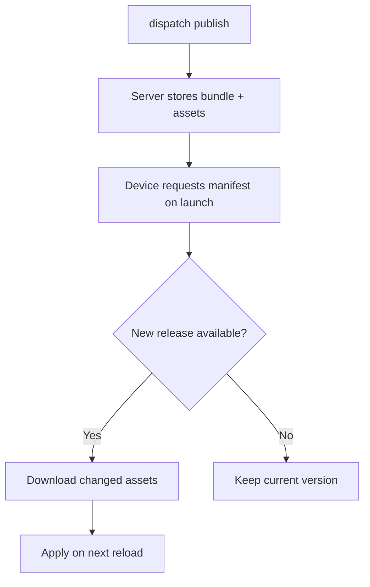

## Publishing

The fastest way to publish:

```bash
dispatch publish -m "Fix checkout button alignment"
```

See [`dispatch publish`](/cli/publish) for all options.

### Publish options

The dashboard publish flow is a two-step wizard with more options than the CLI shorthand:

- **Multi-channel publishing** — Publish the same build to multiple channels at once (e.g., staging and production).
- **Release notes** — Attach a human-readable message to the release.
- **Initial rollout percentage** — Set a per-release rollout slider (0–100%) controlling what percentage of devices receive this release.
- **Critical release** — Mark a release as critical (`isCritical`) to force an immediate app reload instead of waiting for the next cold start.
- **Rollout policy** — Select a rollout policy to automate staged rollout and auto-rollback.
- **Linked feature flags** — Attach feature flags to the release, with per-flag enable/disable or variation selection. Flags are toggled as the rollout progresses.

### With the API

Upload a build, then publish it:

```bash
# Upload
curl -X POST https://api.appdispatch.com/v1/ota/builds \
  -H "Authorization: Bearer YOUR_API_KEY" \
  -H "X-Project: your-project-slug" \
  -F "runtimeVersion=1.0.0" \
  -F "platform=ios" \
  -F "message=Deployed from CI" \
  -F "assets=@dist/bundles/ios.js"

# Publish
curl -X POST https://api.appdispatch.com/v1/ota/builds/42/publish \
  -H "Authorization: Bearer YOUR_API_KEY" \
  -H "X-Project: your-project-slug" \
  -H "Content-Type: application/json" \
  -d '{"channel": "production", "rolloutPercentage": 100, "isCritical": false, "releaseMessage": "Fix checkout button", "linkedFlags": []}'
```

## Multi-platform releases

The CLI automatically groups iOS and Android builds under a single `groupId`. With the API, pass the `groupId` from the first publish response to the second.

## Rollbacks

Create a rollback to revert devices to the embedded update, or target a specific prior release using `rollbackToUpdateId`:

```bash
# Rollback to embedded update
curl -X POST https://api.appdispatch.com/v1/ota/rollback \
  -H "Authorization: Bearer YOUR_API_KEY" \
  -H "X-Project: your-project-slug" \
  -H "Content-Type: application/json" \
  -d '{"runtimeVersion": "1.0.0", "platform": "ios", "channel": "production"}'

# Rollback to a specific release
curl -X POST https://api.appdispatch.com/v1/ota/rollback \
  -H "Authorization: Bearer YOUR_API_KEY" \
  -H "X-Project: your-project-slug" \
  -H "Content-Type: application/json" \
  -d '{"runtimeVersion": "1.0.0", "platform": "ios", "channel": "production", "rollbackToUpdateId": 42}'
```

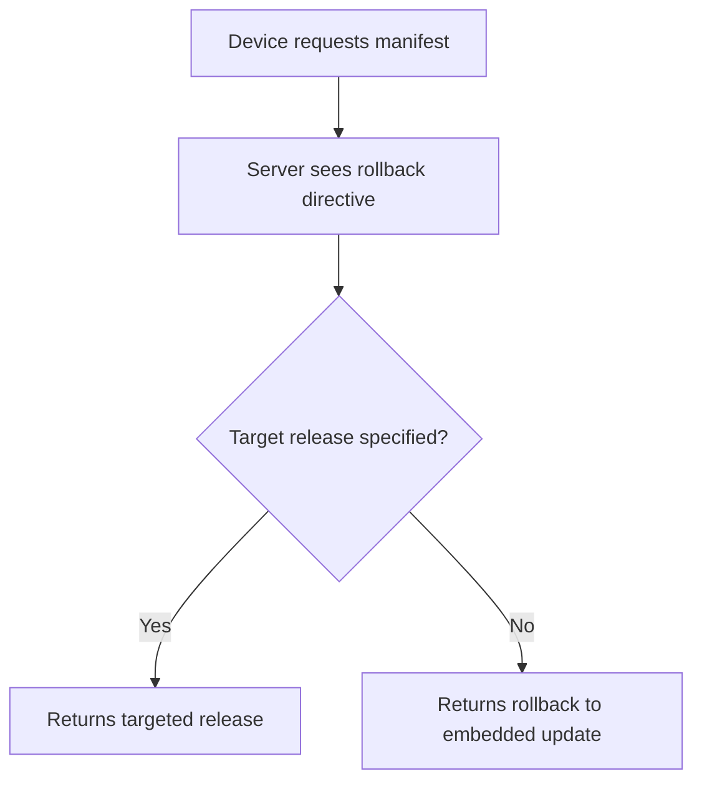

Rollbacks are instant (no download needed when reverting to embedded), non-destructive (the old release is still stored), and per-platform.

### Per-release controls

Each release has individual controls available from the dashboard or API:

- **`isEnabled`** — Toggle a release on or off. Disabled releases are skipped by devices, effectively removing them from the channel without a full rollback.
- **`isCritical`** — When enabled, devices apply this release immediately on detection instead of waiting for the next cold start.
- **Rollout percentage** — A per-release slider (0–100%) controlling what fraction of devices receive this specific release.

When using [rollout policies](/updates/rollout-policies), rollback is graduated — you can revert a single linked flag, roll back the entire release, or roll back an entire channel. See [graduated rollback](/updates/rollout-policies#graduated-rollback) for details.

## Content-addressed storage

Assets are stored by their MD5 hash. Identical files across releases are never duplicated — uploads are fast and storage is efficient.

## Runtime versions

Each release is tagged with a **runtime version** fingerprint from your native dependencies. The server only delivers releases to devices with a matching runtime version. Changed native code requires an app store update.

---

<!-- Source: app/updates/channels/page.mdx -->
# Channels & Branches

Channels and branches control which releases reach which devices.

## How they relate

**Branch** — A named stream of releases. Each release is published to a branch.

**Channel** — What devices connect to. Each channel points to a branch. When a device requests the latest release for a channel, the server looks up the branch and returns the latest release on that branch.

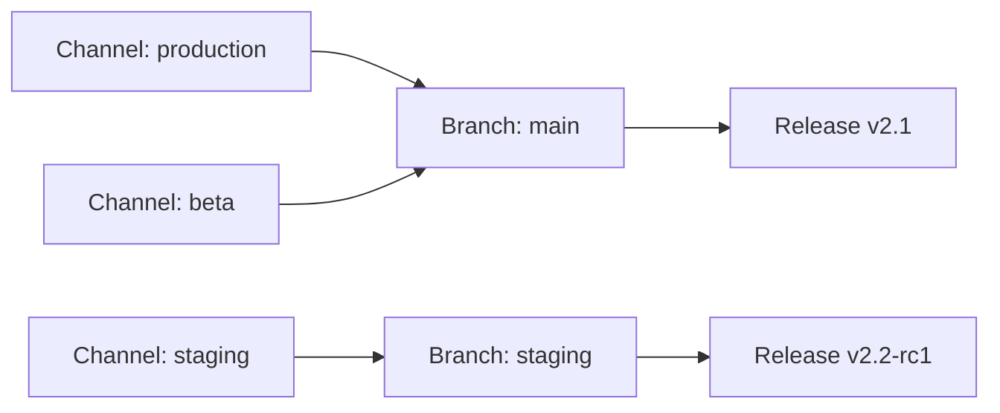

Multiple channels can point to the same branch. This lets you "promote" a release by repointing a channel rather than re-publishing.

## Creating channels

Create channels from the dashboard or API:

```bash
curl -X POST https://api.appdispatch.com/v1/ota/channels \
  -H "Authorization: Bearer YOUR_API_KEY" \
  -H "X-Project: your-project-slug" \
  -H "Content-Type: application/json" \
  -d '{"name": "staging", "branchName": "staging"}'
```

## Creating branches

```bash
curl -X POST https://api.appdispatch.com/v1/ota/branches \
  -H "Authorization: Bearer YOUR_API_KEY" \
  -H "X-Project: your-project-slug" \
  -H "Content-Type: application/json" \
  -d '{"name": "staging"}'
```

## Percentage rollouts

Channels support **rollout branches** — serve a percentage of devices from a different branch. This is useful for canary deployments.

```bash
curl -X PATCH https://api.appdispatch.com/v1/ota/channels/production \
  -H "Authorization: Bearer YOUR_API_KEY" \
  -H "X-Project: your-project-slug" \
  -H "Content-Type: application/json" \
  -d '{
    "rolloutBranchName": "canary",
    "rolloutPercentage": 10
  }'
```

This sends 10% of devices to the `canary` branch while 90% stay on the channel's primary branch.

Rollout bucketing is **deterministic** — a given device always lands in the same bucket based on its device ID. This means a user won't flip between branches on successive launches.

## User overrides

Override specific users to receive releases from a different branch, regardless of their channel configuration:

```bash
curl -X POST https://api.appdispatch.com/v1/ota/user-overrides \
  -H "Authorization: Bearer YOUR_API_KEY" \
  -H "X-Project: your-project-slug" \
  -H "Content-Type: application/json" \
  -d '{"userId": "user-123", "branchName": "beta-testers"}'
```

User overrides take priority over channel rollout. This is useful for internal testing — point your team to a branch before releasing to everyone.

## Minimum runtime version

Channels can enforce a **minimum runtime version**. If a device's runtime version is below the minimum, the server tells the device to update via the app store instead of delivering an OTA release.

```bash
curl -X PATCH https://api.appdispatch.com/v1/ota/channels/production \
  -H "Authorization: Bearer YOUR_API_KEY" \
  -H "X-Project: your-project-slug" \
  -H "Content-Type: application/json" \
  -d '{"minRuntimeVersion": "2.0.0"}'
```

## How devices connect

Your `app.json` configures which channel the device uses:

```json
{
  "expo": {
    "updates": {
      "url": "https://api.appdispatch.com/v1/ota/manifest/your-project",
      "requestHeaders": {
        "expo-channel-name": "production"
      }
    }
  }
}
```

The device sends these headers on each manifest request:
- `expo-channel-name` — Which channel to check
- `expo-runtime-version` — The device's runtime version
- `expo-platform` — `ios` or `android`
- `expo-device-id` — Used for rollout bucketing
- `expo-user-id` — Used for user overrides and flag targeting

---

<!-- Source: app/updates/rollout-policies/page.mdx -->
# Rollout Policies

Rollout policies automate progressive deployments. Instead of manually bumping rollout percentages and watching dashboards, you define a policy once and AppDispatch advances through stages automatically — or rolls back if health metrics degrade.

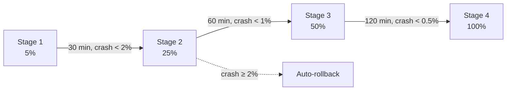

## How it works

A rollout policy is a reusable template of **stages**. Each stage defines:

- **Target percentage** — What percentage of devices receive the release at this stage
- **Wait time** — How long to observe before advancing
- **Minimum devices** — How many devices must receive the release before the stage is considered valid
- **Thresholds** — Health metrics that must stay within bounds

When you publish a release and attach a policy, AppDispatch creates an **execution** — a live instance of the policy running against that release. The execution advances through stages automatically when conditions are met, and halts or rolls back if they aren't.

## Stages

Stages run in order. Each stage holds at its target percentage until all advancement conditions are met:

| Condition | Purpose |
|-----------|---------|
| Wait time elapsed | Give the release time to soak |
| Minimum devices reached | Ensure enough data points for meaningful metrics |
| All thresholds passing | Health metrics are within acceptable bounds |

Once all conditions pass, the execution advances to the next stage. When the final stage completes, the rollout is marked as **completed** at 100%.

### Example: Safe Production Rollout

| Stage | Percentage | Wait | Min Devices | Thresholds |
|-------|-----------|------|-------------|------------|
| 1 | 5% | 30 min | 100 | Crash rate < 2%, JS error rate < 5% |
| 2 | 25% | 60 min | 500 | Crash rate < 1%, JS error rate < 3% |
| 3 | 50% | 120 min | 2,000 | Crash rate < 0.5%, JS error rate < 1% |
| 4 | 100% | — | — | — |

The final stage typically has no thresholds — by the time you've passed through 50% of devices, the release is proven safe.

## Thresholds

Each threshold monitors a health metric and defines what happens if the metric is violated:

| Metric | Description |
|--------|-------------|
| `crash_rate` | Percentage of sessions ending in a native crash |
| `js_error_rate` | Percentage of sessions with unhandled JS errors |

### Threshold actions

| Action | Behavior |
|--------|----------|
| **Gate** | Prevent advancement to the next stage. The rollout stays at its current percentage until the metric recovers. |
| **Auto-rollback** | Trigger a [bundle-level rollback](#bundle-level-rollback) — revert the release and all linked flag overrides. Devices receive the previous release and flags return to their pre-release state. |

A threshold configured as a gate gives you time to investigate before things get worse. A threshold configured as an auto-rollback acts as an automated safety net.

## Linked flags

When publishing a release, you can attach **linked feature flags** — flags whose state is scoped to the release rather than toggled globally. The rollout policy controls both the release delivery **and** the flag state for the devices it reaches.

This is the key distinction: linked flags are not global toggles. A flag linked to a release is only active for devices that received that release. Everyone else sees the default flag state.

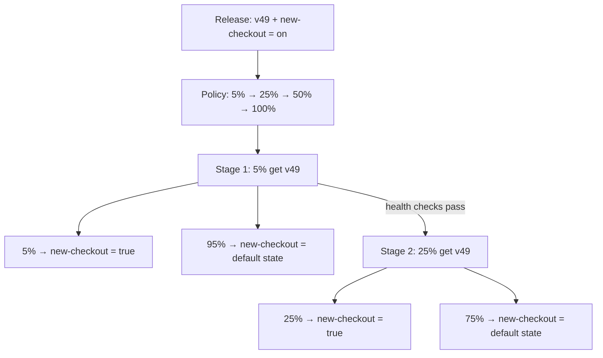

### How evaluation works

When a device evaluates a flag, AppDispatch checks if the device is on a release that configures that flag. Linked flag overrides take precedence over the default flag state:

1. Is the device on a release that links this flag? → Return the release's target value
2. Otherwise → Evaluate normal flag rules

This means the release owns the state of that flag for its audience, regardless of the default configuration.

### All flag types

Linked flags work with every flag type, not just booleans:

| Flag type | What you configure | Example |
|-----------|-------------------|---------|
| `boolean` | Enable or Disable | `new-checkout` → Enable |
| `string` | A specific variation | `checkout-layout` → "Single Page" |
| `number` | A specific variation | `max-cart-items` → 50 |
| `json` | A specific variation | `checkout-config` → `{"maxRetries": 5}` |

For boolean flags, you toggle between Enable and Disable. For string, number, and JSON flags, you pick from the flag's defined [variations](/feature-flags#variations) — for example, choosing "Single Page" from a checkout layout flag with variations like "Single Page", "Multi Step", and "Accordion".

### Release-to-global handoff

The release handles the **deployment phase** — getting the code onto devices with a specific flag state. Once the rollout completes, flag management moves to the normal [Feature Flags](/feature-flags) workflow.

For example, using a string flag with lifecycle variations (`off`, `shadow`, `live`, `complete`):

1. Create flag `new-payment-engine` as a string type with variations: `off`, `shadow`, `live`, `complete`. Default: `off`
2. Ship a release with `new-payment-engine` → `shadow` and a rollout policy (5% → 25% → 100%)
3. As the rollout progresses, devices in each stage get the release **and** shadow mode — the new payment engine runs in the background, logging results against the old engine
4. Release hits 100% — every device has the code + shadow. The release's job is done
5. Go to Feature Flags, update the default value: `shadow` → `live` (new engine serves real results). Monitor. Then `live` → `complete` (remove old code path). Eventually clean up the flag

The release is responsible for atomic deploy + initial activation. Everything after that is the flag's own lifecycle, managed through the Feature Flags UI.

### Graduated rollback

Because linked flags tie flag state to the release, rollback isn't binary — you get three levels of response, from surgical to nuclear:

#### Flag-level rollback

Revert a single flag override while keeping the release deployed. Devices fall back to the pre-release flag state for that flag only.

Use this when a specific feature is causing issues but the rest of the release is fine. For example, if `new-checkout` is spiking errors but `redesigned-profile` is healthy, revert just `new-checkout` and keep everything else live.

#### Bundle-level rollback

Revert the entire release and remove all linked flag overrides. Devices receive the previous release, and all linked flags return to their pre-release state.

This is the standard rollback — equivalent to "undo this release." Automated threshold auto-rollbacks use this level.

#### Channel-level rollback

Revert **all active releases** on a channel. Every device on the channel receives the last stable release, and all linked flag overrides across all releases are removed.

This is the nuclear option for when multiple releases have compounding issues. It affects all users on the channel.

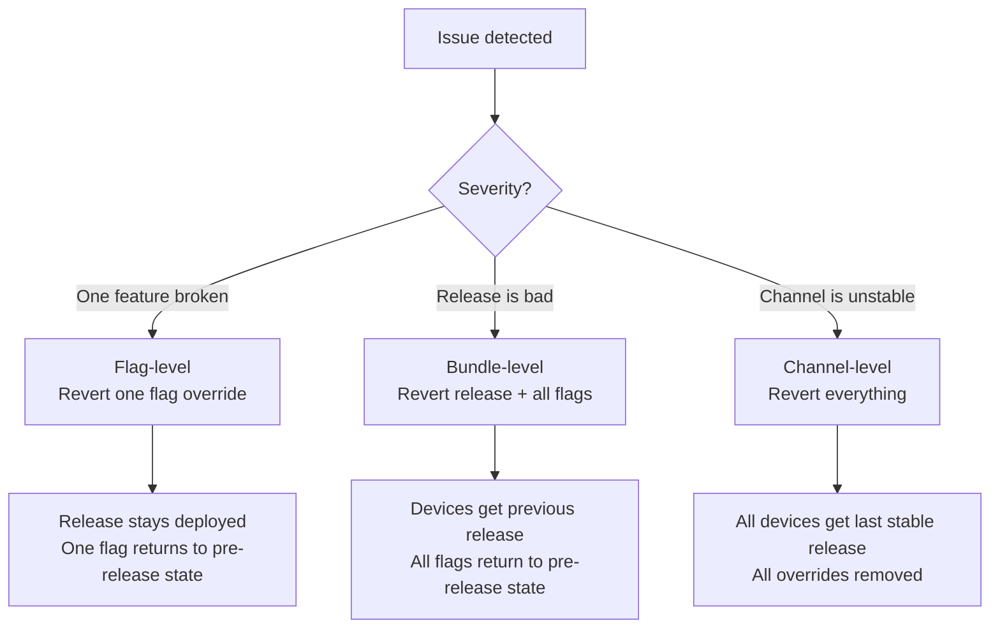

Each level has a confirmation dialog explaining the blast radius before you commit.

### Conflict warnings

The dashboard warns you when a linked flag configuration conflicts with the default state:

- **Redundant override** — A boolean flag is already enabled (or disabled) globally and the release override matches. The override has no additional effect. *"Already enabled for all users — this override has no additional effect."*
- **Partial rollout conflict** — A flag is already rolling out to some percentage of users globally. The release override takes precedence for devices in the release rollout, which may cause unexpected overlap. *"This flag is already rolling out to 25% of users. The release override will take precedence for devices in this rollout."*

For non-boolean flags, redundancy checks are skipped since you're picking a specific variation value that may differ from the global default.

The typical flow avoids conflicts entirely:

1. Create the flag — leave it globally **off** (or at its default variation)
2. Ship a release with the flag set to the desired value and a rollout policy
3. As the policy progresses, more devices get the flag via the release
4. At 100%, update the default flag value to match and remove the flag from future releases

### Linking flags to a release

In the publish flow, after selecting a channel and rollout policy, search and link feature flags. For each flag:

- **Boolean flags** show an Enable/Disable toggle
- **String, number, and JSON flags** show a dropdown of the flag's variations

The same device identity that determines the rollout bucket also determines the flag state, so bucketing is consistent across releases and flags.

## Executions

An execution is a live rollout in progress. The execution detail view streams updates in real time via Server-Sent Events (SSE), so stage transitions, metric changes, and auto-rollbacks appear instantly without refreshing. Each execution tracks:

- **Current stage and percentage** — Where the rollout is right now
- **Health metrics** — Live crash rate, JS error rate, app launches, unique devices
- **Linked flags** — Which flags are linked to this release and their target state
- **Audit log** — Every stage transition, pause, resume, and rollback with timestamps and reasons

### Execution statuses

| Status | Meaning |
|--------|---------|
| **Active** | Rollout is progressing through stages |
| **Paused** | Manually paused — won't advance until resumed |
| **Completed** | Reached 100% and all thresholds passed |
| **Rolled back** | A threshold violation triggered an auto-rollback |
| **Cancelled** | Manually cancelled before completion |

### Manual controls

Even with automated policies, you retain full control:

- **Pause** — Freeze at the current percentage while you investigate
- **Resume** — Continue advancing through stages
- **Advance** — Skip to the next stage (overrides wait time and thresholds)
- **Revert flag** — Remove a single linked flag override, keeping the release deployed
- **Roll back release** — Revert the release and all linked flag overrides
- **Roll back channel** — Revert all active releases on the channel

## Creating a policy

Policies are created from **Rollouts → Policies** in the dashboard. Define:

1. **Name and description** — e.g. "Safe Production Rollout"
2. **Channel** — Which channel this policy applies to
3. **Stages** — Add stages with target percentages, wait times, and thresholds

Policies are reusable — create one policy per risk profile and apply it to any release.

Each policy has an **active/inactive toggle**. Inactive policies are hidden from the publish flow but remain available for re-activation.

You can **edit** or **delete** policies from the policy detail view. Editing is locked while an execution is running against the policy — pause or complete the execution first. Deleting a policy does not affect already-completed executions.

### Common policy patterns

**Canary release** — Start extremely small, then scale quickly:

| Stage | Percentage | Wait |
|-------|-----------|------|
| 1 | 1% | 15 min |
| 2 | 10% | 30 min |
| 3 | 50% | 60 min |
| 4 | 100% | — |

**Fast staging rollout** — Minimal gates for non-production:

| Stage | Percentage | Wait |
|-------|-----------|------|
| 1 | 50% | 10 min |
| 2 | 100% | — |

**High-risk production** — Extra conservative for critical apps:

| Stage | Percentage | Wait | Min Devices |
|-------|-----------|------|-------------|
| 1 | 1% | 60 min | 200 |
| 2 | 5% | 120 min | 1,000 |
| 3 | 25% | 240 min | 5,000 |
| 4 | 50% | 360 min | 10,000 |
| 5 | 100% | — | — |

## Rollout policies + linked flags + channels

These three systems work together:

1. **[Channels](/updates/channels)** route devices to branches and handle deterministic bucketing
2. **[Feature flags](/feature-flags)** control feature visibility — globally or linked to a release
3. **Rollout policies** automate the progression and tie everything together

A typical workflow for a major feature launch:

1. Create a feature flag `new_checkout` — leave it globally **off**
2. Ship the code behind the flag in a build
3. Publish a new release with `new_checkout` → **Enable** and the "Safe Production Rollout" policy
4. Stage 1: 5% of devices get the release and `new_checkout = true`. The other 95% stay on the previous version with `new_checkout = false`
5. Health checks pass → Stage 2: 25% now have the release and the flag on
6. If crashes spike, the release rolls back — devices leave the release group and `new_checkout` falls back to its pre-release state (off)
7. At 100%, all devices have the flag via the release. Optionally flip the default value to **on** and remove the flag from future releases

---

<!-- Source: app/updates/ci-cd/page.mdx -->
# CI/CD Pipeline

Automate OTA deployments with GitHub Actions so every push to `main` publishes a release — unless native code changed.

## Overview

The workflow below does two things:

1. **Detects native changes** — If iOS/Android code, Podfile, Gradle files, or native dependencies changed, the OTA deploy is skipped with a warning. Those changes require a full app store build.
2. **Publishes an OTA release** — If only JavaScript changed, it installs the Dispatch CLI and publishes the release to your chosen channel.

## Setup

### 1. Add secrets and variables

In your GitHub repo, go to **Settings → Secrets and variables → Actions** and add:

| Type | Name | Value |
|------|------|-------|
| Secret | `DISPATCH_API_KEY` | API key from **Dashboard → Settings** |

### 2. Create the workflow file

Copy this to `.github/workflows/ota-deploy.yml` in your React Native app repo:

```yaml filename=".github/workflows/ota-deploy.yml"
name: OTA Release

on:
  push:
    branches: [main]
  workflow_dispatch:
    inputs:
      channel:
        description: 'Channel to publish to'
        required: false
        default: 'production'
        type: choice
        options:
          - production
          - staging
          - canary
      is_critical:
        description: 'Mark as critical release (force immediate reload)'
        required: false
        default: false
        type: boolean
      rollout_percentage:
        description: 'Rollout percentage (1-100)'
        required: false
        default: '100'
        type: string

env:
  DISPATCH_API_KEY: ${{ secrets.DISPATCH_API_KEY }}
  DISPATCH_VERSION: latest

jobs:
  check-native-changes:
    name: Check for native changes
    runs-on: ubuntu-latest
    outputs:
      native_changed: ${{ steps.check.outputs.native_changed }}
    steps:
      - uses: actions/checkout@v4
        with:
          fetch-depth: 2

      - name: Detect native dependency changes
        id: check
        run: |
          NATIVE_CHANGED=false

          NATIVE_PATTERNS=(
            "ios/"
            "android/"
            "Podfile"
            "Podfile.lock"
            "build.gradle"
            "gradle.properties"
            "app.json"
            "app.config.js"
            "app.config.ts"
            "expo-env.d.ts"
          )

          CHANGED_FILES=$(git diff --name-only HEAD~1 HEAD)

          for pattern in "${NATIVE_PATTERNS[@]}"; do
            if echo "$CHANGED_FILES" | grep -q "^${pattern}"; then
              echo "Native change detected in: $pattern"
              NATIVE_CHANGED=true
              break
            fi
          done

          if echo "$CHANGED_FILES" | grep -q "^package.json"; then
            DEPS_BEFORE=$(git show HEAD~1:package.json | jq -r '.dependencies // {} | keys[]' 2>/dev/null | sort)
            DEPS_AFTER=$(git show HEAD:package.json | jq -r '.dependencies // {} | keys[]' 2>/dev/null | sort)

            ADDED=$(comm -13 <(echo "$DEPS_BEFORE") <(echo "$DEPS_AFTER"))
            REMOVED=$(comm -23 <(echo "$DEPS_BEFORE") <(echo "$DEPS_AFTER"))

            if [ -n "$ADDED" ] || [ -n "$REMOVED" ]; then
              echo "Package dependencies changed:"
              [ -n "$ADDED" ] && echo "  Added: $ADDED"
              [ -n "$REMOVED" ] && echo "  Removed: $REMOVED"
              NATIVE_CHANGED=true
            fi
          fi

          echo "native_changed=$NATIVE_CHANGED" >> "$GITHUB_OUTPUT"

  deploy-ota:
    name: Publish OTA release
    needs: check-native-changes
    if: needs.check-native-changes.outputs.native_changed == 'false'
    runs-on: ubuntu-latest
    steps:
      - uses: actions/checkout@v4

      - uses: actions/setup-node@v4
        with:
          node-version: 20
          cache: npm

      - run: npm ci

      - name: Install Dispatch CLI
        run: |
          if [ "$DISPATCH_VERSION" = "latest" ]; then
            DOWNLOAD_URL="https://github.com/AppDispatch/cli/releases/latest/download/dispatch-linux-x64"
          else
            DOWNLOAD_URL="https://github.com/AppDispatch/cli/releases/download/${DISPATCH_VERSION}/dispatch-linux-x64"
          fi
          curl -sL "$DOWNLOAD_URL" -o /usr/local/bin/dispatch
          chmod +x /usr/local/bin/dispatch

      - name: Login to Dispatch
        run: dispatch login --key "$DISPATCH_API_KEY"

      - name: Publish release
        run: |
          ARGS=(
            --channel "${{ inputs.channel || 'production' }}"
            --rollout "${{ inputs.rollout_percentage || '100' }}"
            -m "$(git log -1 --pretty=%s)"
          )

          if [ "${{ inputs.is_critical }}" = "true" ]; then
            ARGS+=(--critical)
          fi

          dispatch publish "${ARGS[@]}"

  warn-native-change:
    name: Warn - native changes detected
    needs: check-native-changes
    if: needs.check-native-changes.outputs.native_changed == 'true'
    runs-on: ubuntu-latest
    steps:
      - name: Skip OTA - native changes require full build
        run: |
          echo "::warning::Native dependencies changed — OTA release skipped."
          echo "Changes to iOS/Android native code, Podfile, build.gradle, or package dependencies"
          echo "require a full app store build."
          echo ""
          echo "After submitting the new binary, future JS-only pushes will resume OTA releases."
```

## How it works

### Native change detection

The `check-native-changes` job inspects the diff between the current and previous commit. It flags native changes if any of these paths were modified:

- `ios/`, `android/` — Native project directories
- `Podfile`, `Podfile.lock` — CocoaPods dependencies
- `build.gradle`, `gradle.properties` — Android build config
- `app.json`, `app.config.js`, `app.config.ts` — Expo config (may change native modules)
- `package.json` — Checked for added or removed dependencies (version bumps are ignored)

If native changes are detected, the OTA release is skipped and a warning annotation appears on the workflow run.

### Manual triggers

You can trigger the workflow manually from the **Actions** tab in GitHub to:

- **Choose a channel** — Deploy to `production`, `staging`, or `canary`
- **Mark as critical** — Forces an immediate reload on devices instead of waiting for the next app launch (`isCritical`)
- **Set rollout percentage** — Gradually roll out to a subset of users (e.g. `10` for 10%)

### Pinning the CLI version

By default the workflow downloads the latest CLI release. To pin to a specific version, change the `DISPATCH_VERSION` env var:

```yaml
env:
  DISPATCH_VERSION: v0.1.12
```

---

<!-- Source: app/feature-flags/page.mdx -->
# Feature Flags

AppDispatch includes a built-in feature flag system that evaluates flags **on-device** with no per-evaluation network calls. Flags are fetched once on app launch and cached locally, then evaluated against targeting rules using the [OpenFeature](https://openfeature.dev) standard.

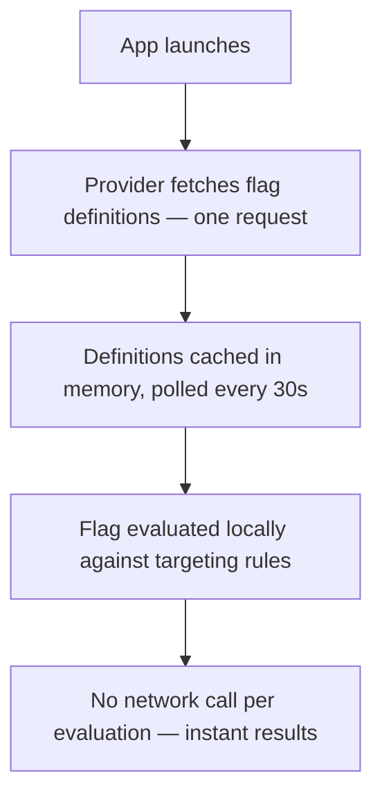

## Flag types

| Type | Example values | Use case |
|------|---------------|----------|
| `boolean` | `true`, `false` | Kill switches, feature toggles |
| `string` | `"variant-a"`, `"blue"` | A/B test variants, theme selection |
| `number` | `42`, `0.5` | Limits, thresholds, numeric configs |
| `json` | `{"maxRetries": 3}` | Complex configuration objects |

## Targeting rules

Rules control which users see which flag value. They're evaluated in **priority order** (lowest number first). The first matching rule wins.

### User list

Target specific users by ID:

```jsx
// Set evaluation context in your app
OpenFeature.setContext({ targetingKey: currentUser.id })
```

Users whose `targetingKey` matches the rule's user list receive the targeted variation.

### Percentage rollout

Gradually roll out to a percentage of users. Rollout is **deterministic** — a given user always gets the same result for the same flag, using FNV-1a hashing of `flagKey + targetingKey`.

### Attribute rules

Target users based on context attributes like plan, platform, app version, or any custom property:

```jsx
// Set rich context in your app
OpenFeature.setContext({
  targetingKey: currentUser.id,
  kind: 'user',
  name: currentUser.name,
  plan: 'pro',
  platform: Platform.OS,       // 'ios' or 'android'
  appVersion: '2.4.1',
  country: 'US',
})
```

Attribute rules support these operators:

| Operator | Description | Example |
|----------|-------------|---------|
| `eq` | Equals | `plan eq "pro"` |
| `neq` | Not equals | `plan neq "free"` |
| `in` | In list | `country in ["US", "CA", "GB"]` |
| `not_in` | Not in list | `country not_in ["CN"]` |
| `contains` | String contains | `email contains "@company.com"` |
| `starts_with` | String starts with | `email starts_with "admin"` |
| `gt`, `gte`, `lt`, `lte` | Numeric comparison | `age gte 18` |
| `semver_gte`, `semver_lte` | Semver comparison | `appVersion semver_gte "2.0.0"` |
| `exists` | Attribute is present | `beta_tester exists` |
| `not_exists` | Attribute is absent | `legacy_flag not_exists` |

Multiple conditions in a rule are combined with AND — all must match.

### Segment rules

Target users who match a **segment** — a reusable set of conditions defined once and shared across flags. Instead of rebuilding "platform = iOS AND plan = pro" on every flag, create an "iOS Pro Users" segment and reference it.

Segment rules show the segment name, estimated device count, and a preview of the conditions. When the segment is updated, every flag referencing it picks up the change automatically.

See [Segments](/feature-flags/segments) for details on creating and managing segments.

### OTA update rules

Target devices based on their update state. This is unique to AppDispatch — because the same SDK handles both updates and flags, flag rules can reference what code is actually running on the device.

Three match modes are available:

**Runtime version** — Only evaluate for devices running a specific runtime version:

| Operator | Meaning |
|----------|---------|
| `≥` | Runtime version is at least this value |
| `>` | Runtime version is greater than this value |
| `≤` | Runtime version is at most this value |
| `<` | Runtime version is below this value |

This eliminates the most common feature flag failure: enabling a flag for users who don't have the code yet. If a flag requires code shipped in runtime version `49.0.0`, add a rule with `runtime version ≥ 49.0.0` and it's impossible for the flag to activate on an older build.

**Branch** — Target devices on a specific branch (e.g. `canary`, `staging`). Useful for enabling a flag only for devices receiving updates from a particular branch.

**Updated within** — Target devices that received an update within the last N days. Useful for features that depend on recent assets or for identifying stale clients.

### Priority

A typical setup:

| Priority | Rule | Purpose |
|----------|------|---------|
| 0 | User list: internal team | Always see new feature |
| 1 | OTA: runtime version ≥ 49.0.0 | Only devices with the code |
| 2 | Segment: "iOS Pro Users" | Reusable audience gets early access |
| 3 | Percentage rollout: 10% | Gradual rollout to everyone else |

Rules are evaluated top-to-bottom. The first match wins. In this example, the OTA rule at priority 1 acts as a gate — devices below runtime version 49 skip this rule and fall through to lower-priority rules or the default value.

## Variations

Flags can have multiple **variations** — named values that rules can return. For a boolean flag, you typically have `true` and `false`. For string flags, you can have as many as you need:

| Variation | Value | Use case |
|-----------|-------|----------|
| Control | `"checkout-v1"` | Original checkout |
| Variant A | `"checkout-v2"` | Single-page checkout |
| Variant B | `"checkout-v3"` | Checkout with progress bar |

Percentage rollout rules distribute users across variations with custom weights.

## Health & analytics

Every flag tracks health metrics per variation — error rate, crash-free percentage, and affected devices. The flag list surfaces issues at a glance: flags with degraded health show a badge with the worst variation and its error rate.

In the flag detail view, evaluation analytics show daily volume, per-variation breakdowns, and a time-series chart. The health panel compares variations side-by-side so you can see if one variation is performing worse than another.

See [Flag Health](/insights/flag-health) for the full breakdown, and [Telemetry](/insights) for cross-dimensional attribution across flags and releases.

## Per-environment settings

Flags can be configured independently per **channel** (environment). Enable a flag in staging while keeping it off in production, or set different default values per environment.

### Typical workflow

1. **Development** — Flag enabled, targeting all users
2. **Staging** — Flag enabled, targeting QA team via user list
3. **Production** — Flag enabled, 10% rollout, monitoring metrics
4. **Production** — Increase to 50%, then 100%
5. **All environments** — Remove the flag, clean up code

## Linked flags

Flags can be **linked to a release** instead of toggled globally. When you publish an update with a [rollout policy](/updates/rollout-policies), you can attach flags and set their target value — a boolean toggle, a specific string variation, a number, or a JSON object. The override is only active for devices that received that release. Everyone else sees the pre-release state.

The rollout policy controls both the update delivery **and** the flag state. At 5% rollout, only those 5% of devices see the linked flag value. Because flag state is tied to the release, rollback is graduated — you can [revert a single flag](/updates/rollout-policies#flag-level-rollback) while keeping the update deployed, roll back the entire release, or roll back an entire channel.

Flag evaluation order:

1. Is the device on a release that configures this flag? → Return the release's value
2. Otherwise → Evaluate flag rules as normal (targeting, percentage rollout, default)

Once a release reaches 100%, the release's job is done. From there, manage the flag through the normal Feature Flags UI — change variations, update targeting rules, or clean up the flag entirely.

See [Rollout Policies](/updates/rollout-policies#linked-flags) for the full workflow, including multi-type examples and the release-to-global handoff pattern.

## Evaluation reasons

Each evaluation includes a `reason`:

| Reason | Meaning |
|--------|---------|
| `RELEASE_OVERRIDE` | Flag value set by a release the device is on |
| `DISABLED` | Flag is turned off |
| `DEFAULT` | No rules matched |
| `TARGETING_MATCH` | A user list or attribute rule matched |
| `SEGMENT_MATCH` | A segment rule matched |
| `SPLIT` | A percentage rollout rule determined the value |
| `ERROR` | Something went wrong |

---

<!-- Source: app/feature-flags/contexts/page.mdx -->
# Contexts

Contexts represent the **devices, users, and other entities** that evaluate your feature flags. Every time an SDK evaluates a flag, it reports the evaluation context — who or what requested the flag value, along with any attributes attached to that entity.

The Contexts dashboard gives you visibility into every entity that has interacted with your flags: what they evaluated, when, and which variations they received.

## Context kinds

Each context has a **kind** that describes the type of entity it represents:

| Kind | Description |
|------|-------------|
| **user** | An individual user of your application |
| **device** | A specific device (phone, tablet, browser instance) |
| **organization** | A company, team, or account that groups multiple users |
| **service** | A backend service or microservice evaluating flags server-side |
| **environment** | A deployment environment (production, staging, development) |

The kind determines how the context icon appears in the dashboard (each kind has a distinct color-coded icon) and lets you filter the contexts list.

## How contexts are created

Contexts are created **automatically** when your SDK evaluates flags. When you call `OpenFeature.setContext()` and flags are evaluated, the SDK reports the evaluation context back to AppDispatch. No manual setup is needed — as soon as devices start evaluating flags, their contexts appear in the dashboard.

For SDK setup details, see [Setting evaluation context](/feature-flags/sdk#setting-evaluation-context). For how evaluations are reported, see [OpenFeature integration](/feature-flags/openfeature).

You can also [create contexts manually](#creating-contexts-manually) from the dashboard.

## Contexts list view

The contexts list shows all known evaluation contexts with:

| Column | Description |
|--------|-------------|
| **Kind icon** | Color-coded icon indicating the context kind |
| **Targeting key** | The unique identifier for this context within its kind |
| **Kind badge** | Label showing user, device, organization, service, or environment |
| **Name** | Optional display name |
| **Attribute chips** | Up to 3 attribute key-value pairs displayed inline, with an overflow indicator if more exist |
| **Evaluation count** | Total number of flag evaluations for this context |
| **Last seen** | When this context last evaluated a flag |

Results are paginated at 50 contexts per page.

### Filtering

- **Search** — Filter by targeting key, name, or attribute value.
- **Kind filter** — Dropdown to show only contexts of a specific kind.

## Context detail view

Click any context to open its detail dialog. The detail view shows:

**Summary**

- Targeting key, kind, and name
- Total evaluations, first seen, and last seen timestamps

**Attributes table**

All attributes reported by the SDK for this context, displayed as key-value pairs.

**Flag evaluation history**

A per-flag breakdown of every flag this context has evaluated:

| Column | Description |
|--------|-------------|
| **Flag name** | Display name of the flag |
| **Key** | The flag key |
| **Channel** | Which channel the evaluation occurred in |
| **Variation** | The variation value the context received |
| **Eval count** | Number of times this context evaluated this flag |
| **Last evaluated** | When the most recent evaluation occurred |

## Creating contexts manually

While contexts are typically created automatically via SDK evaluations, you can create them manually from the dashboard. Click **Create Context** and fill in:

| Field | Description |
|-------|-------------|
| **Kind** | Select from a visual grid of the 5 context kinds |
| **Targeting key** | Unique identifier for this context |
| **Name** | Optional display name |
| **Attributes** | Dynamic key-value pairs — add as many as needed |

Manually created contexts are useful for testing flag targeting rules before devices start reporting in.

## Deleting contexts

To delete a context, click the delete button on the context row or in the detail view. Deleting a context **removes all evaluation history** for that entity. This action cannot be undone.

---

<!-- Source: app/feature-flags/segments/page.mdx -->
# Segments

Segments are **reusable audience definitions** for feature flag targeting. Instead of rebuilding the same conditions on every flag, define a segment once and reference it from any number of flags.

Think of segments as saved filters — "iOS Pro Users" or "Beta Testers" — that you can apply with one click when creating targeting rules.

## How segments differ from inline rules

| | Inline attribute rule | Segment rule |
|---|---|---|
| **Scope** | One flag | Reusable across flags and rollouts |
| **Conditions** | Defined on the flag | Defined once, referenced by key |
| **Maintenance** | Edit each flag individually | Update the segment, all flags reflect the change |
| **Use case** | One-off targeting | Shared audiences used across multiple flags |

If you find yourself copying the same conditions across flags, create a segment instead.

Segments can be edited after creation — update conditions, match logic, or metadata at any time. Changes propagate to all flags and rollouts that reference the segment.

## Creating a segment

In the dashboard, go to **Contexts → Segments** and click **Create Segment**.

Each segment has:

| Field | Description |
|-------|-------------|
| **Name** | Display name (e.g., "iOS Pro Users") |
| **Key** | Auto-generated from the name (e.g., `ios-pro-users`). Used to reference the segment in rules and the API. |
| **Description** | What this segment represents |
| **Match logic** | **All conditions** (AND) or **Any condition** (OR) |
| **Conditions** | One or more attribute rules |

### Conditions

Each condition tests a context attribute against a value:

```
platform eq "ios"
plan in ["pro", "enterprise"]
ota.runtime_version semver_gte "2.4.0"
```

Conditions use the same operators as [attribute rules](/feature-flags#attribute-rules):

| Operator | Description |
|----------|-------------|
| `eq` / `neq` | Equals / not equals |
| `in` / `not_in` | In list / not in list |
| `contains`, `starts_with` | String matching |
| `gt`, `gte`, `lt`, `lte` | Numeric comparison |
| `semver_gte`, `semver_lte` | Semver comparison |
| `exists` / `not_exists` | Attribute presence (no value needed) |

### Match logic

- **All conditions (AND)** — Every condition must match. Use for narrow, specific audiences.
- **Any condition (OR)** — At least one condition must match. Use for broader audiences.

### OTA-aware conditions

Segments can include OTA context attributes like `ota.branch`, `ota.runtime_version`, and `ota.updated_within_days`. This means a segment can define an audience like "Android devices on runtime 2.4.0+ from the canary branch" — combining user attributes with device update state in a single reusable definition.

## Using segments in flag rules and rollouts

When adding a targeting rule to a flag or rollout, select **Segment** as the rule type and pick from the dropdown. The rule card shows:

- Segment name and estimated device count
- All conditions with match logic (AND/OR)
- Variation picker — which value devices in this segment receive

A segment rule evaluates to true when the current evaluation context matches the segment's conditions. Like all rules, it's evaluated in [priority order](/feature-flags#priority) — first match wins.

### Example priority setup

| Priority | Rule | Purpose |
|----------|------|---------|
| 0 | User list: internal team | Always see new feature |
| 1 | OTA: runtime version ≥ 49.0.0 | Only devices with the code |
| 2 | Segment: "iOS Pro Users" | Pro iOS users get early access |
| 3 | Percentage rollout: 10% | Gradual rollout to everyone else |

## Device estimates

Each segment shows an **estimated device count** — how many currently active devices match the segment's conditions. This helps you gauge the blast radius before attaching a segment to a flag.

Estimates are approximate and based on the most recent context data from active devices.

## Reference tracking

The segment detail view shows a **Referenced by** list — every flag or rollout that uses this segment as a targeting rule. You can't delete a segment that's still referenced by flags or rollouts. Remove the segment rules from those flags and rollouts first, then delete.

## Segments vs. channels

Both segments and channels define groups of devices, but they serve different purposes:

| | Channels | Segments |
|---|---|---|
| **Controls** | OTA update delivery | Feature flag targeting |
| **Grouping** | By environment (production, staging) | By user/device attributes |
| **Mechanism** | Branch mapping + percentage rollout | Attribute conditions (AND/OR) |
| **Scope** | Which code a device runs | Which flag values a device sees |

Channels are your deployment boundaries. Segments are your targeting boundaries within a deployment.

---

<!-- Source: app/feature-flags/sdk/page.mdx -->
# SDK

The AppDispatch SDK (`@appdispatch/react-native`) is a single package that handles OTA updates, feature flags, and health reporting. It wraps [OpenFeature](https://openfeature.dev) for flag evaluation and includes built-in error tracking with flag correlation.

## Installation

```bash npm2yarn
npm install @appdispatch/react-native
```

Peer dependencies: `react` (≥18), `react-native` (≥0.70). `expo-updates` (≥0.20) is optional but required for OTA update features.

## Setup

Initialize the SDK at module level (before any component renders), then wrap your app with `AppDispatchProvider`:

```jsx filename="app/_layout.tsx"
import {
  AppDispatch,
  AppDispatchProvider,
  useOTAUpdates,
} from '@appdispatch/react-native'

AppDispatch.init({
  baseUrl: 'https://api.appdispatch.com',
  projectSlug: 'my-app',
  apiKey: 'YOUR_API_KEY',
  channel: 'production',
})

export default function RootLayout() {
  useOTAUpdates()

  return (
    <AppDispatchProvider>
      <YourApp />
    </AppDispatchProvider>
  )
}
```

That's it. `AppDispatch.init()` sets up the OpenFeature provider and health reporter. `AppDispatchProvider` wraps your app with the OpenFeature context and starts health monitoring on mount. `useOTAUpdates()` checks for OTA updates, handles device ID generation, and applies critical updates immediately.

## Evaluating flags

Flag hooks are re-exported from `@appdispatch/react-native` — no need to import from `@openfeature/react-sdk` directly:

```jsx
import {
  useBooleanFlagValue,
  useStringFlagValue,
  useNumberFlagValue,
  useObjectFlagValue,
} from '@appdispatch/react-native'

function MyComponent() {
  // Boolean — kill switches, feature toggles
  const enabled = useBooleanFlagValue('new-checkout', false)

  // String — A/B variants, theme names
  const variant = useStringFlagValue('theme', 'default')

  // Number — limits, thresholds
  const limit = useNumberFlagValue('max-items', 10)

  // JSON — complex config objects
  const config = useObjectFlagValue('settings', {})
}
```

The second argument is the **default value** — returned when the flag doesn't exist, is disabled, or the provider hasn't loaded yet.

For more detailed evaluation results, use the `Details` variants:

```jsx
import { useBooleanFlagDetails } from '@appdispatch/react-native'

const { value, reason, variant } = useBooleanFlagDetails('new-checkout', false)
```

## Setting evaluation context

For targeting rules, set the evaluation context with the user's identity and any attributes you want to target on:

```jsx
import { OpenFeature } from '@openfeature/react-sdk'
import { Platform } from 'react-native'

// Set after login — include any attributes your targeting rules use
OpenFeature.setContext({
  targetingKey: currentUser.id,
  kind: 'user',
  name: currentUser.displayName,
  email: currentUser.email,
  plan: currentUser.plan,            // 'free', 'pro', 'enterprise'
  platform: Platform.OS,             // 'ios', 'android'
  appVersion: '2.4.1',
  country: currentUser.country,
})
```

- `targetingKey` (required for targeting) — unique identifier for user list and percentage rollout rules
- `kind` — context type, defaults to `"user"`. Use `"device"`, `"organization"`, `"service"`, or `"environment"` for non-user contexts
- `name` — display name shown in the Contexts dashboard
- All other properties are custom attributes available for [attribute targeting rules](/feature-flags#attribute-rules) and [segment conditions](/feature-flags/segments)

Update the context whenever attributes change (e.g., plan upgrade):

```jsx
OpenFeature.setContext({
  ...existingContext,
  plan: 'pro',
})
```

## Health reporting

Health reporting is built into the SDK — no separate package needed. The `AppDispatchProvider` starts health monitoring automatically on mount and stops it on unmount.

To record custom events or errors manually, access the health reporter via `AppDispatch.instance`:

```jsx
// Record custom business events
AppDispatch.instance.health.recordEvent('checkout_success')

// Record errors manually
AppDispatch.instance.health.recordError('Payment gateway timeout')

// Force flush buffered events
await AppDispatch.instance.health.flush()
```

See [Health Reporter](/feature-flags/health-reporter) for details on auto-capture, flag correlation, and event deduplication.

## Configuration options

| Option | Type | Default | Description |
|--------|------|---------|-------------|
| `baseUrl` | string | **required** | AppDispatch API URL |
| `projectSlug` | string | **required** | Project slug from the dashboard |
| `apiKey` | string | — | API key for authenticated requests |
| `channel` | string | — | Channel (e.g., `production`, `staging`) |
| `deviceId` | string | — | Stable device identifier. Auto-generated and persisted if omitted. |
| `platform` | string | — | `"ios"` or `"android"`. Auto-detected from React Native if omitted. |
| `updateId` | string | — | Current OTA update ID. Auto-detected from expo-updates if omitted. |
| `runtimeVersion` | string | — | Runtime version. Auto-detected from expo-updates if omitted. |
| `flagPollIntervalMs` | number | `30000` | How often to refresh flag definitions (ms) |
| `flagFlushIntervalMs` | number | `60000` | How often to send evaluation reports (ms) |
| `healthFlushIntervalMs` | number | `30000` | How often to send health events (ms). Set to `0` to disable. |
| `autoCaptureErrors` | boolean | `true` | Auto-capture JS errors and crashes via `ErrorUtils` |
| `trackAppLaunches` | boolean | `true` | Track app launches via `AppState` |
| `maxBufferSize` | number | `100` | Max health events before forcing a flush |

## How it works

1. `AppDispatch.init()` creates the OpenFeature provider and health reporter, wiring flag correlation automatically
2. The provider fetches all flag definitions in one request and caches them in memory
3. Polls for flag definition updates every 30 seconds (configurable)
4. Flag evaluations happen locally — no network call per evaluation
5. Deterministic hashing ensures stable rollout bucketing
6. Evaluations are batched and reported every 60 seconds for analytics
7. Health events (errors, crashes, launches) are buffered and flushed every 30 seconds
8. Errors are correlated with active flag states at the moment they occur

See [OpenFeature Provider](/feature-flags/openfeature) for the full evaluation architecture.

## Advanced: accessing internals

The `AppDispatch.instance` object exposes the underlying provider and health reporter for advanced use cases:

```jsx
// Access the OpenFeature provider directly
const provider = AppDispatch.instance.provider
const flags = provider.getFlags() // All loaded flag definitions

// Access the health reporter directly
const health = AppDispatch.instance.health
```

---

<!-- Source: app/feature-flags/health-reporter/page.mdx -->
# Health Reporter

The health reporter is built into `@appdispatch/react-native` — no separate package needed. It collects JS errors, crashes, custom events, and app launches, and reports them to AppDispatch in batches. When an error occurs, it snapshots which flag variations are active, enabling the [cross-dimensional attribution](/insights) that powers flag health and telemetry.

## Setup

If you're using `AppDispatchProvider` (the recommended setup), health monitoring starts automatically on mount and stops on unmount. No extra configuration needed:

```jsx
import { AppDispatch, AppDispatchProvider } from '@appdispatch/react-native'

AppDispatch.init({
  baseUrl: 'https://api.appdispatch.com',
  projectSlug: 'my-app',
  channel: 'production',
})

export default function App() {
  return (
    <AppDispatchProvider>
      <YourApp />
    </AppDispatchProvider>
  )
}
```

Health reporting options are part of the `AppDispatch.init()` configuration:

| Option | Type | Default | Description |
|--------|------|---------|-------------|
| `healthFlushIntervalMs` | number | `30000` | How often to send buffered events. Set to `0` to disable auto-flush. |
| `autoCaptureErrors` | boolean | `true` | Auto-capture JS errors and crashes via `ErrorUtils` |
| `trackAppLaunches` | boolean | `true` | Track app launches via `AppState` |
| `maxBufferSize` | number | `100` | Max buffered events before forcing a flush |

## Auto-capture

When `autoCaptureErrors` is enabled (the default), the reporter hooks into React Native's `ErrorUtils` to capture unhandled JS errors:

- **Fatal errors** are recorded as `crash` events
- **Non-fatal errors** are recorded as `js_error` events
- The existing error handler is preserved — the reporter chains onto it, not replaces it

When `trackAppLaunches` is enabled, the reporter detects app launches via `AppState` transitions (`background/inactive → active`) and records `app_launch` events.

Both hooks gracefully no-op if running outside React Native.

## Recording events manually

Access the health reporter via `AppDispatch.instance.health`:

```jsx
import { AppDispatch } from '@appdispatch/react-native'

// Custom business events
AppDispatch.instance.health.recordEvent('checkout_success')
AppDispatch.instance.health.recordEvent('payment_timeout')

// Manual error recording
AppDispatch.instance.health.recordError('API returned 500 on /cart')

// Force flush buffered events
await AppDispatch.instance.health.flush()
```

`recordEvent` creates a `custom` event. `recordError` creates a `js_error` event and snapshots the current flag states for correlation.

Both accept an optional `count` parameter for pre-aggregated events:

```jsx
AppDispatch.instance.health.recordEvent('retry_attempt', 3)
```

## Flag state correlation

This is the key feature. The SDK automatically wires flag correlation during `AppDispatch.init()` — no manual setup needed.

When an error occurs, the reporter snapshots which flag variations are active **at the moment the error happens** — not at flush time. This captures a map of `flagKey → variationValue` from the provider's internal evaluation buffer and attaches it to the event.

On the backend, these flag states are used to:
- Attribute errors to specific flag variations in the [flag impact matrix](/insights#flag-impact-matrix)
- Power per-variation health metrics in [flag health](/insights/flag-health)
- Detect anomalies correlated with specific flags in [telemetry](/insights#correlated-events)

## Event deduplication

Events are deduplicated in the buffer by `(type, name, message)`. If the same error fires 50 times between flushes, it's sent as a single event with `count: 50` instead of 50 separate events. This keeps payloads small without losing signal.

When a duplicate event is added, the most recent flag state snapshot overwrites the previous one, so the correlation reflects the latest state.

## Flush behavior

Events are sent to AppDispatch in two scenarios:

1. **Timer** — Every 30 seconds (configurable via `healthFlushIntervalMs`)
2. **Buffer full** — When the buffer reaches `maxBufferSize` events

Each flush POSTs to `/v1/ota/health-metrics` with the buffered events, device metadata, and the current `expo-updates` state (update UUID and runtime version, resolved automatically).

Network failures are handled gracefully — a warning is logged but events are not retried. This prevents unbounded memory growth on devices with poor connectivity.

## Lifecycle

When using `AppDispatchProvider`, the lifecycle is managed automatically — health monitoring starts on mount and stops (with a final flush) on unmount.

For manual control:

```jsx
// Start collecting and flushing
AppDispatch.instance.start()

// Stop — tears down hooks, flushes remaining events
await AppDispatch.instance.stop()
```

## Backend processing

When events arrive at the backend:

1. **Raw storage** — Events are inserted into a raw events table with a 30-day TTL
2. **Hourly aggregation** — Counts are bucketed by hour, channel, platform, runtime version, and event type for efficient querying
3. **Anomaly detection** — If the current hour's error count exceeds 2x the 24-hour average (and more than 5 errors), an anomaly event is created and correlated with the most common flag state in the error batch
4. **Daily statistics** — Error rate and crash-free percentages are updated in the daily stats table

This pipeline feeds the [telemetry dashboard](/insights), [flag health](/insights/flag-health), and the health thresholds used by [rollout policies](/updates/rollout-policies).

---

<!-- Source: app/feature-flags/openfeature/page.mdx -->
# OpenFeature Provider

AppDispatch implements the [OpenFeature](https://openfeature.dev) standard — an open, vendor-neutral API for feature flag evaluation. You get a standard interface that works across providers, and you can swap AppDispatch for any other OpenFeature-compatible provider without changing your application code.

## Why OpenFeature?

Most mobile feature flag tools use proprietary SDKs. If you switch providers, you rewrite every flag evaluation in your codebase. OpenFeature solves this with a standard API:

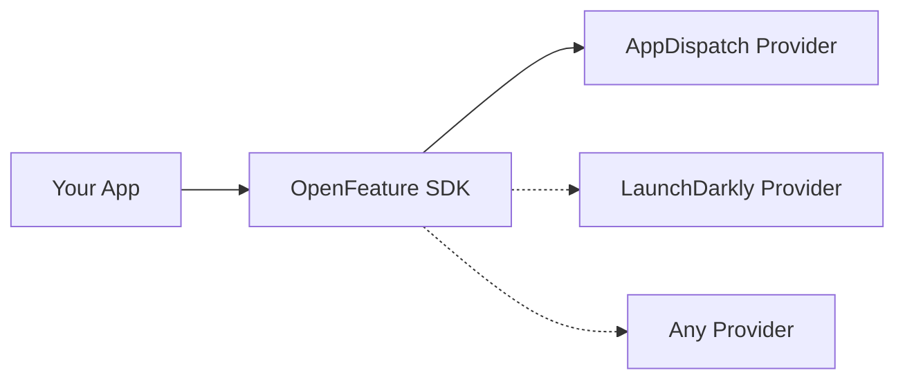

You write your flag evaluations once using the OpenFeature SDK. The provider handles the implementation details.

The `@appdispatch/react-native` package re-exports all OpenFeature hooks (`useBooleanFlagValue`, `useStringFlagValue`, etc.) so you don't need to install or import from `@openfeature/react-sdk` directly.

## Client-side evaluation

All evaluation happens on the device. The provider fetches a compact set of flag definitions (key, type, default value, rules, variations) and evaluates them locally.

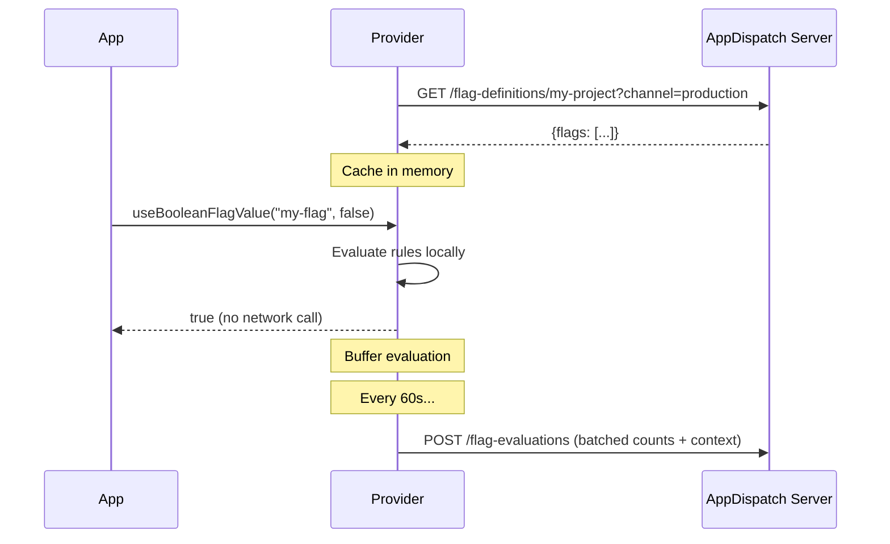

### Deterministic rollouts

Percentage rollouts use FNV-1a hashing of `flagKey + targetingKey` to produce a stable bucket (0-99). The same user always gets the same result for the same flag, across sessions and devices.

## Evaluation reporting

The provider automatically reports flag evaluations back to AppDispatch for analytics. Evaluations are **batched in memory** and flushed every 60 seconds (configurable via `flagFlushIntervalMs`). A final flush happens when the provider closes.

This powers the **Contexts** page and per-flag **evaluation charts** in the dashboard — showing which users evaluated which flags and how often.

No individual evaluation triggers a network call. If a flag is evaluated 1,000 times in a minute, one HTTP request is sent with the aggregated counts.

---

<!-- Source: app/insights/page.mdx -->
# Telemetry

When something breaks in a mobile app, the first question is always: *was it the release or the flag?* With separate tools for deployment and feature flags, you're left guessing. AppDispatch owns both pipelines, so it can answer that automatically.

> **Crash spike detected**
>
> Runtime version: `49.0.0` · Flag: `new-checkout = true` · Channel: production · Affected devices: 4%

Instead of digging through logs to correlate a crash with a deploy, AppDispatch surfaces the exact flag variation, release version, and channel in one view. This is **cross-dimensional attribution** — every error is tagged with the device's flag state and release version at the moment it occurred.

## Overview metrics

The telemetry dashboard shows four summary metrics, weighted by flag variation:

| Metric | Description |
|--------|-------------|
| **Devices tracked** | Total devices weighted by active flag variations |
| **Weighted error rate** | Error rate across all devices, weighted by variation population size |
| **Crash-free rate** | Percentage of sessions without native crashes, weighted the same way |
| **Active issues** | Number of currently open correlated events |

## Error rate over time

An area chart showing error rate trends over 7, 14, or 30 days. Spikes are visually obvious and can be cross-referenced with the correlated events below.

## Flag evaluations over time

A bar chart showing daily flag evaluation counts. Useful for spotting sudden drops (stale clients not polling) or spikes (new feature rollout driving evaluation volume).

## Correlated events

AppDispatch automatically detects anomalies and attributes them to specific flag variations and release versions:

| Field | Description |
|-------|-------------|
| **Event type** | `crash_spike`, `error_spike`, `latency_spike`, `adoption_drop` |
| **Severity** | `critical`, `warning`, `info` |
| **Status** | `incident`, `degraded`, `healthy` |
| **Flag variation** | Which flag + variation is correlated with the anomaly |
| **Runtime version** | Which release version is correlated |

Each correlated event tells you exactly what combination of code and configuration triggered the issue — so you can revert a single flag or roll back a release with confidence, not guesswork.

## Flag impact matrix

A table that slices health metrics by flag variation, update version, and channel:

| Column | Description |
|--------|-------------|
| **Flag / Variation** | Which flag and which variation value |
| **Update** | Runtime version the devices are running |
| **Channel** | Which channel (production, staging, etc.) |
| **Devices** | Number of devices in this slice |
| **Error rate** | Error rate with a delta badge showing change from baseline |
| **Crash-free** | Crash-free percentage (highlighted red if below 99%) |

### Filtering

Filter the matrix by:

- **Flag** — Isolate a specific flag to compare its variations
- **Channel** — Focus on production vs staging
- **Time range** — 7, 14, or 30 days

### Reading the matrix

The flag impact matrix answers questions like:

- *"Is the `new-checkout = true` variation crashing more than `false`?"* — Compare error rates across rows for the same flag
- *"Did runtime version 49 introduce a regression?"* — Compare rows with different runtime versions for the same flag state
- *"Is the issue specific to production or also on staging?"* — Filter by channel

This is the surface that makes linked flags and rollout policies actionable — you're not just deploying progressively, you're measuring the impact of each variation at each stage.

---

<!-- Source: app/insights/adoption/page.mdx -->
# Adoption

The Adoption dashboard shows how releases spread across your device population — which versions are running on how many devices, and how quickly new releases are adopted.

## Summary metrics

Three top-level cards:

| Metric | Description |
|--------|-------------|
| **Total Active Devices** | Total devices currently tracked across all release versions |
| **Releases tracked** | Number of distinct release versions in the field |
| **Downloads** | Total asset downloads over the selected time range (7, 14, 30, or 90 days) |

## Downloads over time

A bar chart showing daily download volume. Useful for:

- Confirming a new release is being picked up
- Spotting adoption stalls (downloads plateau early)
- Verifying rollout policy progression (downloads increase as percentage ramps up)

You can adjust the time range to 7, 14, 30, or 90 days.

## Device distribution

A stacked horizontal bar showing the percentage of devices on each release version, color-coded by version. Below the bar, a table breaks it down:

| Column | Description |
|--------|-------------|
| **Version** | The release version identifier |
| **Channel** | Which channel the release was published to |
| **Branch** | The branch the release lives on |
| **Update ID** | Truncated release UUID for reference |
| **Devices** | Number of devices on this version + percentage of total |

### What to look for

- **Long tail of old versions** — Devices not updating. Check if they're below the channel's minimum runtime version or if the release is gated behind a rollout percentage.
- **Rapid convergence** — A new release quickly dominates. Expected for critical releases or 100% rollouts.
- **Split distribution** — Devices evenly split between two versions. Normal during a rollout policy execution (e.g., 25% on new, 75% on old).

---

<!-- Source: app/insights/flag-health/page.mdx -->
# Flag Health

Every feature flag in AppDispatch tracks health metrics per variation, so you can see whether a specific flag value is correlated with errors or crashes.

## Evaluation analytics

Each flag's detail view shows evaluation data over a configurable time range (7, 14, 30, or 90 days):

- **Total evaluations** — How many times the flag was evaluated in the period
- **Last evaluated** — When the most recent evaluation occurred
- **Per-variation breakdown** — For each variation, the evaluation count and percentage of total. Inactive variations (0 evaluations) are shown grayed out.
- **Evaluations over time** — A daily bar chart showing evaluation volume. Drops may indicate stale clients; spikes correlate with rollout progression.

## Health metrics

Flag health is tracked per variation and per channel:

| Metric | Description |
|--------|-------------|
| **Error rate** | Percentage of sessions with unhandled errors for devices seeing this variation |
| **Error rate delta** | Change from baseline — red if increasing, green if decreasing |
| **Crash-free** | Percentage of sessions without native crashes (highlighted red if below 99%) |
| **Affected devices** | Number of devices contributing to the metric |
| **Status** | `healthy`, `degraded`, or `incident` |

### Per-variation health table

The health panel breaks down metrics by variation and channel:

| Variation | Channel | Devices | Error rate | Crash-free | Status |
|-----------|---------|---------|-----------|-----------|--------|
| On | production | 1,247 | 1.2% (+0.7%) | 99.1% | degraded |
| Off | production | 3,580 | 0.5% (+0.1%) | 99.8% | healthy |

This makes it immediately clear when one variation is performing worse than another. If `On` has a 1.2% error rate and `Off` has 0.5%, the flag's feature is likely the cause.

### Health in the flag list

The flag list view surfaces health issues without requiring you to open each flag:

- Flags with degraded or incident status show a health badge in the list row
- The badge shows the worst variation and its error rate (e.g., *"On: 1.2% errors"*)
- Per-channel columns show 7-day evaluation counts and a stacked variation bar

## Health during rollout executions

When a flag is attached to a [rollout policy](/updates/rollout-policies), its health is tracked as part of the execution:

- Each linked flag in the execution detail view shows its own health metrics
- Status badges (`healthy` / `degraded` / `incident`) appear per flag
- Error rate and crash-free percentage are shown with delta badges
- If a flag's health degrades, you can [revert that specific flag](/updates/rollout-policies#flag-level-rollback) while keeping the update deployed

This per-flag health tracking during rollouts is what enables surgical response — rather than rolling back an entire release because "something is wrong", you can see exactly which flag variation is causing the issue and revert just that one.

## How metrics are collected

Health metrics come from two sources working together:

1. **Flag evaluations** — The [OpenFeature provider](/feature-flags/sdk) reports which flags were evaluated and which variations were returned, in batches every 60 seconds.
2. **Health events** — The [health reporter](/feature-flags/health-reporter) in `@appdispatch/react-native` captures JS errors, crashes, and app launches, and snapshots which flag variations were active at the moment each error occurred.

When the health reporter is [connected to the provider](/feature-flags/health-reporter#flag-state-correlation), errors are automatically correlated with flag states. The backend aggregates these into per-variation health metrics — no custom instrumentation needed.

See [Health Reporter](/feature-flags/health-reporter) for setup instructions.

---

<!-- Source: app/insights/observe/page.mdx -->
# Observe

The Observe dashboard is a real-time event viewer for errors, crashes, and custom events reported by your devices. It surfaces problems as they happen so you can triage issues without leaving AppDispatch.

Events are sent by the `@appdispatch/react-native` health reporter running on each device. See [Health Reporter setup](/feature-flags/health-reporter) for installation and configuration.

## Summary cards

Three top-level cards:

| Metric | Description |
|--------|-------------|
| **Errors** | Total JavaScript errors received |
| **Crashes** | Total fatal crashes received |
| **Custom Events** | Total custom events sent by your app |

## Tabs

Four tabs filter the event list by type:

| Tab | Shows |
|-----|-------|
| **All** | Every event except internal `app_launch` events |
| **Errors** | Non-fatal JavaScript errors (`js_error`) |
| **Crashes** | Fatal crashes (`crash`) |
| **Events** | Custom events sent from your app code |

## Filtering

- **Search** — Free-text search across event messages and names.
- **Channel** — Filter by deployment channel: production, staging, or canary.
- **Platform** — Filter by platform: iOS or Android.

## Event list

Each row in the list shows:

| Field | Description |
|-------|-------------|
| **Message** | The event or error message |
| **Event name** | Identifier for the event type |
| **Fatal badge** | Shown when the event is a fatal crash |
| **Error name** | Badge with the error class name (e.g., `TypeError`) |
| **Count** | Number of occurrences of this event |
| **Timestamp** | When the event was received |
| **Platform** | iOS or Android |
| **Channel** | The channel the device is running on |
| **Device ID** | The reporting device's identifier |
| **Flag count** | Number of feature flags active on the device at the time of the event |

Rows include a collapsed stack trace preview (first two lines) when available.

## Event detail view

Expanding an event shows the full detail panel:

- **Full timestamp** — Exact time the event was received.
- **Platform and channel** — Which platform and deployment channel.
- **Runtime version** — The runtime version running on the device.
- **Device ID** — The reporting device.
- **Fatal / error badges** — Crash severity and error class at a glance.
- **Occurrence count** — How many times this event has been seen.
- **Full stack trace** — The complete JavaScript stack trace.
- **Component stack** — React component hierarchy at the time of the error, when available.
- **Tags** — Key-value metadata attached to the event.
- **Flag states** — Key-value snapshot of every feature flag value on the device when the event occurred. Useful for correlating errors with flag rollouts.
- **Release UUID** — The release identifier the device was running.

## Pagination

Results are paginated at 50 events per page.

## How events are collected

Observe relies on the health reporter SDK (`@appdispatch/react-native`) running on each device. The SDK automatically captures JavaScript errors and crashes, and exposes an API for sending custom events. All events are tagged with the device's current channel, platform, runtime version, and active flag states.

For setup instructions, see [Health Reporter](/feature-flags/health-reporter).

---

<!-- Source: app/insights/audit-log/page.mdx -->
# Audit Log

The Audit Log records every change made across your project — who did what, when, and to which resource. Use it to track deployments, investigate configuration changes, or review teammate activity.

## Category filters

Filter entries by resource type using the tab bar:

- **All** — Every action across the project
- **Releases** — Release creation, patching, republishing, rollbacks, and deletion
- **Builds** — Build uploads, publishing, and deletion
- **Branches** — Branch creation and deletion
- **Channels** — Channel creation, updates, and deletion
- **Flags** — Flag, rule, variation, and environment setting changes
- **Webhooks** — Webhook creation, updates, and deletion

## Search

The search bar matches against action labels, actor names, entity types, and detail values. Useful for finding all actions by a specific user or all changes to a particular flag.

## Tracked actions

Twenty-three action types, grouped by category:

### Builds

| Action | Description |
|--------|-------------|
| `build.uploaded` | A new build was uploaded (typically from CI/CD) |
| `build.published` | A build was published to a channel as a release |
| `build.deleted` | A build was removed |

### Releases

| Action | Description |
|--------|-------------|
| `update.created` | A new release was created |
| `update.patched` | A release was modified (rollout percentage, critical flag, etc.) |
| `update.republished` | A release was republished to additional channels |
| `update.deleted` | A release was removed |
| `update.rollback` | A release was rolled back |

### Branches

| Action | Description |
|--------|-------------|
| `branch.created` | A new branch was created |
| `branch.deleted` | A branch was removed |

### Channels

| Action | Description |
|--------|-------------|
| `channel.created` | A new channel was created |
| `channel.updated` | A channel's configuration was changed |
| `channel.deleted` | A channel was removed |

### Webhooks

| Action | Description |
|--------|-------------|
| `webhook.created` | A new webhook was registered |
| `webhook.updated` | A webhook's URL, events, or status was changed |
| `webhook.deleted` | A webhook was removed |

### Flags

| Action | Description |
|--------|-------------|
| `flag.created` | A new feature flag was created |
| `flag.updated` | A flag's configuration was changed |
| `flag.deleted` | A flag was removed |
| `flag.toggled` | A flag was enabled or disabled |
| `rule.created` | A targeting rule was added to a flag |
| `rule.updated` | A targeting rule was modified |
| `rule.deleted` | A targeting rule was removed |
| `env_setting.updated` | A per-environment flag setting was changed |
| `variation.updated` | A flag variation value was modified |

## Entry details

Each audit log entry includes:

| Field | Description |
|--------|-------------|
| **Action** | The action type (e.g., `build.published`) |
| **Actor** | The user or API key that performed the action, shown with distinct icons for each |
| **Entity** | The resource type and ID that was affected |
| **Details** | Key-value pairs with specifics about the change |
| **Timestamp** | When the action occurred |

## Date grouping

Entries are grouped by date with sticky headers. Recent dates display as **Today**, **Yesterday**, or the weekday name (e.g., **Wednesday**). Older dates use a standard date format.

## Pagination

Results load in pages of 100 entries. Use the **Load more** button at the bottom to fetch the next page (cursor-based pagination).

## API access

You can query the audit log programmatically. See `GET /v1/ota/audit-log` in the [API Reference](/api) for filtering and pagination options.

---

<!-- Source: app/cli/page.mdx -->
# CLI Reference

The Dispatch CLI (`dispatch`) lets you publish OTA releases for your Expo & React Native app from the command line.

## Installation

Download the latest binary for your platform from [GitHub Releases](https://github.com/AppDispatch/cli/releases):

| Platform | Binary |
|----------|--------|
| macOS (Apple Silicon) | `dispatch-darwin-arm64` |
| macOS (Intel) | `dispatch-darwin-x64` |
| Linux (x64) | `dispatch-linux-x64` |
| Linux (ARM64) | `dispatch-linux-arm64` |

```bash
# macOS (Apple Silicon)
curl -sL https://github.com/AppDispatch/cli/releases/latest/download/dispatch-darwin-arm64 \
  -o /usr/local/bin/dispatch
chmod +x /usr/local/bin/dispatch
```

Or pin to a specific version:

```bash
curl -sL https://github.com/AppDispatch/cli/releases/download/v0.1.12/dispatch-darwin-arm64 \
  -o /usr/local/bin/dispatch
chmod +x /usr/local/bin/dispatch
```

## Commands

| Command | Description |
|---------|-------------|
| [`dispatch login`](/cli/login) | Authenticate with AppDispatch |
| [`dispatch init`](/cli/init) | Initialize a project for OTA releases |
| [`dispatch publish`](/cli/publish) | Export and publish an OTA release |

## Global options

```
--help       Print help information
--version    Print version information
```

## Configuration files

The CLI stores configuration in two locations:

### User credentials

Saved by `dispatch login` at `~/.dispatch/credentials.json`:

```json
{
  "server": "https://api.appdispatch.com",
  "apiKey": "your-api-key"
}
```

### Project config

Saved by `dispatch init` at `.dispatch/config.json` in your project root:

```json
{
  "projectUuid": "...",
  "projectSlug": "my-app"
}
```

> Add `.dispatch/` to your `.gitignore` — `dispatch init` does this automatically.

---

<!-- Source: app/cli/login/page.mdx -->
# dispatch login

Authenticate the CLI with AppDispatch.

## Usage

```bash
dispatch login --server <SERVER_URL> --key <API_KEY>
```

## Options

| Flag | Required | Description |
|------|----------|-------------|
| `--server` | No | Server URL (defaults to `https://api.appdispatch.com`; use for self-hosted instances) |
| `--key` | Yes | API key from **Dashboard → Settings → API Keys** |

## Examples

```bash
dispatch login --key dk_live_abc123
```

For self-hosted instances, pass your server URL:

```bash
dispatch login --server https://dispatch.yourcompany.com --key dk_live_abc123
```

## What it does

1. Validates your API key
2. Fetches the list of available projects
3. Saves credentials to `~/.dispatch/credentials.json`

After logging in, you can run `dispatch init` to connect a project.

---

<!-- Source: app/cli/init/page.mdx -->
# dispatch init

Initialize your Expo project for OTA updates. This is an interactive command that connects your local project to an AppDispatch project.

## Usage

```bash
dispatch init
```

> Run this from your project root (where `app.json` lives).

## Prerequisites

- You must run [`dispatch login`](/cli/login) first
- Your project must have an `app.json` file

## What it does

1. **Prompts you to select a project** from your AppDispatch dashboard
2. **Installs dependencies**:
   - `expo-updates` via `npx expo install`
   - `@expo/fingerprint` via `npm install --save-dev`
3. **Patches `app.json`** with the required update configuration:
   ```json
   {
     "expo": {
       "updates": {
         "url": "https://api.appdispatch.com/v1/ota/manifest/<project-uuid>",
         "enabled": true,
         "checkAutomatically": "ON_LOAD"
       },
       "runtimeVersion": {
         "policy": "fingerprint"
       }
     }
   }
   ```
4. **Creates `.dispatch/config.json`** with your project UUID and slug
5. **Adds `.dispatch/` to `.gitignore`**

## After init

You're ready to publish your first update:

```bash
dispatch publish --channel production -m "initial release"
```

---

<!-- Source: app/cli/publish/page.mdx -->
# dispatch publish

Export your Expo app and publish an OTA release to AppDispatch.

## Usage

```bash
dispatch publish [OPTIONS]
```

## Options

| Flag | Default | Description |
|------|---------|-------------|
| `--channel` | `production` | Target channel (e.g. `production`, `staging`, `canary`) |
| `-m`, `--message` | Latest git commit | Release message |
| `--platform` | Both | Platform to build: `ios`, `android`, or both |
| `--rollout` | `100` | Rollout percentage (0–100) |
| `--critical` | `false` | Force immediate reload on devices |
| `--no-publish` | `false` | Upload the build without publishing — publish later from the dashboard |
| `--runtime-version` | Auto-detected | Override the runtime version (skips fingerprint computation) |

## Examples

### Publish to production

```bash
dispatch publish
```

### Publish to staging with a message

```bash
dispatch publish --channel staging -m "fix onboarding bug"
```

### Gradual rollout

```bash
dispatch publish --rollout 10 -m "testing new checkout flow"
```

Then increase later from the dashboard, or publish again with a higher percentage.

### Critical update

```bash
dispatch publish --critical -m "security patch"
```

Critical releases force an immediate reload instead of waiting for the next app launch.

### iOS only

```bash
dispatch publish --platform ios -m "iOS-specific fix"
```

### Upload without publishing

```bash
dispatch publish --no-publish -m "ready for QA review"
```

The build will appear in the dashboard where it can be reviewed and published manually.

## What it does

1. Loads project config from `.dispatch/config.json` and credentials from `~/.dispatch/credentials.json`
2. Computes a runtime fingerprint using `@expo/fingerprint`
3. Runs `npx expo export` for each platform
4. Uploads assets to AppDispatch via multipart upload
5. Publishes the build to the target channel (unless `--no-publish`)

iOS and Android builds are grouped together so they appear as a single release in the dashboard.

---

<!-- Source: app/api/page.mdx -->
# API Reference

All API endpoints are served under `/v1/ota/` and require authentication via an API key (passed as a Bearer token) and a project slug (passed as the `X-Project` header).

```bash
curl https://api.appdispatch.com/v1/ota/updates \
  -H "Authorization: Bearer YOUR_API_KEY" \
  -H "X-Project: your-project-slug"
```

## Authentication

### Headers

| Header | Description |
|--------|-------------|
| `Authorization` | `Bearer YOUR_API_KEY` |
| `X-Project` | Your project slug |

### Getting an API key

Create API keys from the dashboard under **Settings → API Keys**.

---

## Updates

### List updates

```
GET /v1/ota/updates
```

### Create update

```
POST /v1/ota/updates
```

### Update an update

```
PATCH /v1/ota/updates/{id}
```

### Delete update

```
DELETE /v1/ota/updates/{id}
```

### Republish update

```
POST /v1/ota/updates/{id}/republish
```

Republishes an existing update to additional channels or with updated release notes.

```json
{
  "channels": ["staging", "canary"],
  "releaseMessage": "Republished with fix"
}
```

| Field | Type | Required | Description |
|-------|------|----------|-------------|
| `channels` | string[] | No | Channels to publish to |
| `releaseMessage` | string | No | Updated release message |

Returns `{ "updates": [...], "groupId": "uuid" }`.

### Get update history

```
GET /v1/ota/updates/{id}/history
```

---

## Builds

### List builds

```
GET /v1/ota/builds
```

### Upload build

```
POST /v1/ota/builds
```

Multipart form upload. Fields:

| Field | Type | Required | Description |
|-------|------|----------|-------------|
| `runtimeVersion` | string | Yes | Runtime version fingerprint |
| `platform` | string | Yes | `ios` or `android` |
| `message` | string | No | Release message |
| `expoConfig` | JSON | No | Expo app config |
| `gitCommitHash` | string | No | Git commit hash |
| `gitBranch` | string | No | Git branch name |
| `assets` | files | Yes | Bundle and asset files |

### Publish build

Publishes a build to a channel, creating an update (release).

```
POST /v1/ota/builds/{id}/publish
```

```json
{
  "channel": "production",
  "rolloutPercentage": 100,
  "isCritical": false,
  "releaseMessage": "v2.1 release",
  "groupId": "optional-uuid",
  "linkedFlags": [
    { "flagId": 1, "enabled": true }
  ]
}
```

| Field | Type | Required | Description |
|-------|------|----------|-------------|
| `channel` | string | Yes | Target channel name |
| `rolloutPercentage` | number | No | Initial rollout percentage (0–100, default 100) |
| `isCritical` | boolean | No | Mark update as critical |
| `releaseMessage` | string | No | Release notes |
| `groupId` | string | No | UUID to group multi-platform publishes together |
| `linkedFlags` | array | No | Feature flags to link to this release |
| `linkedFlags[].flagId` | number | Yes | Flag ID |
| `linkedFlags[].enabled` | boolean | Yes | Whether the flag is enabled for this release |

### Delete build

```
DELETE /v1/ota/builds/{id}
```

---

## Branches

### List branches

```
GET /v1/ota/branches
```

### Create branch

```
POST /v1/ota/branches
```

```json
{
  "name": "staging"
}
```

### Delete branch

```
DELETE /v1/ota/branches/{name}
```

---

## Channels

### List channels

```
GET /v1/ota/channels
```

### Create channel

```
POST /v1/ota/channels
```

```json
{
  "name": "staging",
  "branchName": "staging"
}
```

### Update channel

```
PATCH /v1/ota/channels/{name}
```

```json
{
  "branchName": "new-branch",
  "rolloutBranchName": "canary",
  "rolloutPercentage": 10,
  "minRuntimeVersion": "2.0.0"
}
```

### Delete channel

```
DELETE /v1/ota/channels/{name}
```

---

## Feature Flags

### List flags

```
GET /v1/ota/flags
```

### Create flag

```
POST /v1/ota/flags
```

```json
{
  "name": "New Checkout",
  "key": "new-checkout",
  "flagType": "boolean",
  "defaultValue": false,
  "enabled": true,
  "description": "Enable the new checkout flow",
  "variations": [
    { "name": "On", "value": "true" },
    { "name": "Off", "value": "false" }
  ]
}
```

### Get flag

```
GET /v1/ota/flags/{id}
```

### Update flag

```
PATCH /v1/ota/flags/{id}
```

### Delete flag

```
DELETE /v1/ota/flags/{id}
```

### Create targeting rule

```
POST /v1/ota/flags/{id}/rules
```

```json
{
  "ruleType": "percentage_rollout",
  "ruleConfig": {
    "rollout": [
      {"variantValue": "true", "weight": 50},
      {"variantValue": "false", "weight": 50}
    ]
  },
  "variantValue": "true",
  "priority": 0,
  "channelName": "production"
}
```

Rule types: `user_list`, `percentage_rollout`, `attribute`, `segment`, `ota_update`

Segment rule example:

```json
{
  "ruleType": "segment",
  "ruleConfig": {
    "segmentKey": "ios-pro-users"
  },
  "variantValue": "true",
  "priority": 2,
  "channelName": "production"
}
```

### Update rule

```
PATCH /v1/ota/flags/{id}/rules/{ruleId}
```

### Delete rule

```
DELETE /v1/ota/flags/{id}/rules/{ruleId}
```

### Update variation

```
PATCH /v1/ota/flags/{id}/variations/{variationId}
```

### Update environment settings

```
PATCH /v1/ota/flags/{id}/env/{channelName}
```

```json
{
  "enabled": true,
  "defaultValue": "variant-a"
}
```

### Get flag evaluations

```
GET /v1/ota/flags/{id}/evaluations
```

### Flag definitions (client endpoint)

```
GET /v1/ota/flag-definitions/{projectSlug}?channel=production
```

Public endpoint used by the OpenFeature provider. Returns enabled flags with their rules and variations for the specified channel.

---

## Health Metrics

### Report health events (client endpoint)

```
POST /v1/ota/health-metrics
```

Public endpoint used by the [health reporter](/feature-flags/health-reporter) in `@appdispatch/react-native`. No authentication required.

```json
{
  "projectSlug": "my-app",
  "deviceId": "device-xyz",
  "channel": "production",
  "platform": "ios",
  "runtimeVersion": "49.0.0",
  "updateUuid": "abc-123",
  "events": [
    {
      "type": "js_error",
      "message": "TypeError: undefined is not an object",
      "count": 3,
      "flagStates": {
        "new-checkout": true,
        "theme": "dark"
      }
    },
    {
      "type": "app_launch",
      "count": 1
    }
  ]
}
```

| Field | Type | Required | Description |
|-------|------|----------|-------------|
| `projectSlug` | string | Yes | Project slug |
| `deviceId` | string | Yes | Stable device identifier |
| `channel` | string | No | Channel name |
| `platform` | string | Yes | `"ios"` or `"android"` |
| `runtimeVersion` | string | Yes | Runtime version from expo-updates |
| `updateUuid` | string | No | Current update UUID from expo-updates |
| `events` | array | Yes | Array of health events |
| `events[].type` | string | Yes | `"js_error"`, `"crash"`, `"custom"`, or `"app_launch"` |
| `events[].name` | string | No | Event name (for custom events) |
| `events[].message` | string | No | Error message |
| `events[].count` | number | Yes | Number of occurrences (deduplicated client-side) |
| `events[].flagStates` | object | No | Flag variations active at error time |

Returns `204 No Content` on success.

---

## Segments

### List segments

```
GET /v1/ota/segments
```

### Create segment

```
POST /v1/ota/segments
```

```json
{
  "name": "iOS Pro Users",
  "key": "ios-pro-users",
  "description": "Pro-tier users on iOS",
  "matchType": "all",
  "conditions": [
    {"attribute": "platform", "operator": "eq", "valuesJson": ["ios"]},
    {"attribute": "plan", "operator": "eq", "valuesJson": ["pro"]}
  ]
}
```

| Field | Type | Required | Description |
|-------|------|----------|-------------|
| `name` | string | Yes | Display name |
| `key` | string | No | Unique key (auto-generated from name if omitted) |
| `description` | string | No | Human-readable description |
| `matchType` | string | Yes | `"all"` (AND) or `"any"` (OR) |
| `conditions` | array | Yes | Array of condition objects |
| `conditions[].attribute` | string | Yes | Context attribute name |
| `conditions[].operator` | string | Yes | Comparison operator |
| `conditions[].valuesJson` | string[] | Yes | Values to match (empty for `exists`/`not_exists`) |

### Get segment

```
GET /v1/ota/segments/{id}
```

### Update segment

```
PATCH /v1/ota/segments/{id}
```

### Delete segment

```
DELETE /v1/ota/segments/{id}
```

Returns `409 Conflict` if the segment is referenced by any flag rules. Remove the segment rules first.

---

## Webhooks

### List webhooks

```
GET /v1/ota/webhooks
```

### Create webhook

```
POST /v1/ota/webhooks
```

```json
{
  "url": "https://your-app.example.com/webhook",
  "events": ["build.published", "channel.updated"],
  "secret": "whsec_your_signing_secret"
}
```

### Update webhook

```
PATCH /v1/ota/webhooks/{id}
```

Use `isActive` to enable or disable a webhook:

```json
{
  "isActive": false
}
```

### Delete webhook

```
DELETE /v1/ota/webhooks/{id}
```

### Get delivery history

```
GET /v1/ota/webhooks/{id}/deliveries
```

---

## Audit Log

### List audit log

```
GET /v1/ota/audit-log?limit=100&before=500
```

| Param | Description |
|-------|-------------|
| `limit` | Max entries to return (default 200, max 200) |
| `action` | Filter by action (e.g., `build.published`) |
| `entity_type` | Filter by entity type (e.g., `update`, `flag`) |
| `entity_id` | Filter by entity ID |
| `before` | Cursor: return entries with ID less than this (for pagination) |

---

## Rollback

### Create rollback

```
POST /v1/ota/rollback
```

```json
{
  "runtimeVersion": "1.0.0",
  "platform": "ios",
  "channel": "production",
  "rollbackToUpdateId": 123
}
```

| Field | Type | Required | Description |
|-------|------|----------|-------------|
| `runtimeVersion` | string | Yes | Runtime version to target |
| `platform` | string | Yes | `"ios"` or `"android"` |
| `channel` | string | Yes | Channel name |
| `rollbackToUpdateId` | number | No | Specific update ID to roll back to. If omitted, rolls back to the embedded update. |

---

## User Overrides

### List overrides

```
GET /v1/ota/user-overrides
```

### Create override

```
POST /v1/ota/user-overrides
```

```json
{
  "userId": "user-123",
  "branchName": "beta-testers",
  "note": "QA tester for v2.1"
}
```

### Delete override

```
DELETE /v1/ota/user-overrides/{id}
```

---

## Contexts

### List contexts

```
GET /v1/ota/contexts
```

Returns all contexts for the project. Supports query parameters for filtering by `kind` and search.

### Create context

```
POST /v1/ota/contexts
```

```json
{
  "kind": "user",
  "targetingKey": "user-abc-123",
  "name": "Alice",
  "attributes": {
    "plan": "pro",
    "platform": "ios"
  }
}
```

| Field | Type | Required | Description |
|-------|------|----------|-------------|
| `kind` | string | Yes | Context kind: `user`, `device`, `organization`, `service`, or `environment` |
| `targetingKey` | string | Yes | Unique key for this context |
| `name` | string | No | Display name |
| `attributes` | object | No | Key-value attributes |

### Get context

```
GET /v1/ota/contexts/{id}
```

### Delete context

```
DELETE /v1/ota/contexts/{id}
```

### List context kinds

```
GET /v1/ota/contexts/kinds
```

Returns the available context kinds: `user`, `device`, `organization`, `service`, `environment`.

---

## Rollout Policies

### List rollout policies

```
GET /v1/ota/rollout-policies
```

### Create rollout policy

```
POST /v1/ota/rollout-policies
```

```json
{
  "name": "Staged production rollout",
  "stages": [
    { "percentage": 5, "minDevices": 100, "minDurationMinutes": 60 },
    { "percentage": 25, "minDevices": 500, "minDurationMinutes": 120 },
    { "percentage": 100, "minDevices": 0, "minDurationMinutes": 0 }
  ],
  "thresholds": {
    "errorRate": 2.0,
    "crashRate": 0.5,
    "action": "auto-rollback"
  }
}
```

### Get rollout policy

```
GET /v1/ota/rollout-policies/{id}
```

### Update rollout policy

```
PATCH /v1/ota/rollout-policies/{id}
```

Editing is locked while an execution is running for this policy.

### Delete rollout policy

```
DELETE /v1/ota/rollout-policies/{id}
```

---

## Rollout Executions

### List executions

```
GET /v1/ota/rollout-executions
```

### Get execution

```
GET /v1/ota/rollout-executions/{id}
```

### Pause execution

```
POST /v1/ota/rollout-executions/{id}/pause
```

### Resume execution

```
POST /v1/ota/rollout-executions/{id}/resume
```

### Cancel execution

```
POST /v1/ota/rollout-executions/{id}/cancel
```

### Advance execution

```
POST /v1/ota/rollout-executions/{id}/advance
```

Manually advances the execution to the next stage.

---

## Flag Health

### Get flag health

```
GET /v1/ota/flags/{id}/health
```

Returns health status for a flag, including error rate, crash-free percentage, affected devices, and per-variation health breakdown.

---

## Adoption

### Get adoption metrics

```
GET /v1/ota/insights/adoption
```

Returns adoption metrics including total active devices and download counts. Supports `days` query parameter (7, 14, 30, or 90).

---

## Telemetry

### Get timeseries data

```
GET /v1/ota/telemetry/timeseries
```

Returns time-bucketed metrics for devices, errors, and crashes over the specified period.

### Get flag impacts

```
GET /v1/ota/telemetry/flag-impacts
```

Returns the flag impact matrix showing error rate and crash-free percentage per flag variation, update, and channel.

### Get telemetry events

```
GET /v1/ota/telemetry/events
```

Returns raw telemetry events with filtering by type, channel, and platform.

---

## Observe

### List observe events

```
GET /v1/ota/observe/events
```

Returns errors, crashes, and custom events from devices. Supports filtering by event type (`js_error`, `crash`, `custom`), channel, and platform. Results are paginated (50 per page).

---

