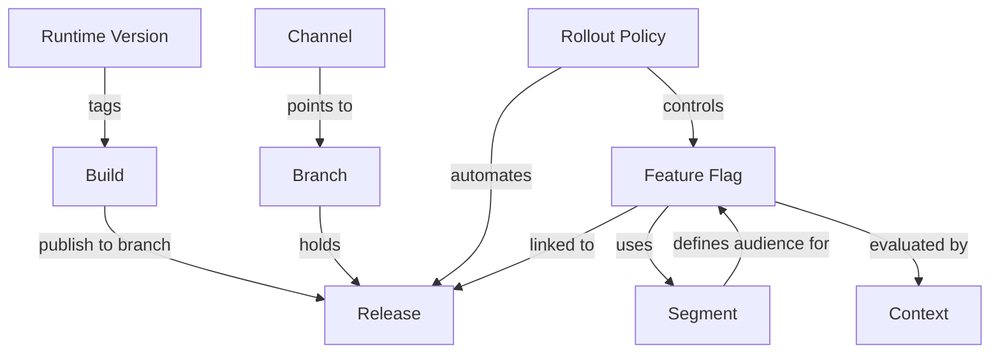

# Core Concepts

AppDispatch has nine core primitives that work together to deliver OTA releases, control feature visibility, and automate progressive deployments. This page explains each one and how they relate — read it once to build a mental model before diving into the feature-specific docs.

## Runtime Version

A runtime version is a fingerprint derived from your app's native dependencies. It determines OTA compatibility — AppDispatch only delivers releases to devices whose runtime version matches the release. When your native code changes (new native module, SDK upgrade, Expo config change), the runtime version changes and devices need an app store update before they can receive new OTA releases.

Runtime versions ensure that a JavaScript bundle is never delivered to a device running incompatible native code.

[Learn more about runtime versions](/updates#runtime-versions)

## Builds

A build is a compiled JavaScript bundle and its assets, uploaded to AppDispatch. Builds are not yet visible to devices — think of a build as a staging area. You upload builds via the CLI (`dispatch publish`) or CI/CD pipeline, and they sit in the builds list until you publish them to a channel.

Each build is tagged with a platform (iOS or Android), a runtime version, git metadata, and a unique identifier.

[Learn more about the build and publish workflow](/updates#publishing)

## Releases

A release is a published build delivered to devices via a channel. The relationship is: **build → publish → release**. Once a build is published, it becomes a release that devices can download.

Each release has per-release controls: a rollout percentage (0–100%) controlling what fraction of devices receive it, a critical flag that forces immediate application instead of waiting for the next cold start, and an enabled toggle that can pull a release from circulation without a full rollback.

[Learn more about releases](/updates)

## Branches

A branch is a named stream of releases. When you publish a build, it lands on a branch. Branches are the organizational layer between releases and channels — they group releases into a linear sequence that channels can point to.

Multiple channels can point to the same branch, which lets you "promote" releases by repointing a channel rather than re-publishing.

[Learn more about branches](/updates/channels)

## Channels

A channel is what devices connect to. Your app's configuration specifies a channel name (e.g., `production`, `staging`), and each channel points to a branch. The indirection is: **channel → branch → releases**. This means you can swap which branch a channel serves without touching device configuration.

Channels also support rollout branches — serve a percentage of devices from a different branch for canary deployments. Rollout bucketing is deterministic, so a given device always lands in the same bucket across launches.

[Learn more about channels](/updates/channels)

## Feature Flags

Feature flags let you toggle features without deploying new code. Flags are evaluated on-device using the OpenFeature standard — definitions are fetched once on app launch and cached locally, so evaluations are instant with no per-call network overhead.

Flags support four types (boolean, string, number, JSON) and multiple targeting rule types: user lists, percentage rollouts, attribute rules, segment rules, and OTA-aware rules that reference runtime version or branch. Flags can also be linked to releases so their state is scoped to a specific rollout rather than toggled globally.

[Learn more about feature flags](/feature-flags)

## Segments

Segments are reusable audience definitions built from attribute conditions with AND or OR logic. Instead of rebuilding the same targeting conditions on every flag, define a segment once — like "iOS Pro Users" or "Beta Testers" — and reference it from any number of flags or rollout policies.

When a segment is updated, every flag and rollout referencing it picks up the change automatically. Each segment also shows an estimated device count so you can gauge blast radius before attaching it to a flag.

[Learn more about segments](/feature-flags/segments)

## Contexts

Contexts represent the entities that evaluate your feature flags — users, devices, organizations, services, and environments. They are created automatically when the SDK evaluates flags, with no manual setup required. Each context carries a targeting key, a kind, and a set of attributes used for targeting.

The Contexts dashboard shows every entity that has interacted with your flags, including what they evaluated, which variations they received, and when. This makes contexts the foundation for both targeting and debugging.

[Learn more about contexts](/feature-flags/contexts)

## Rollout Policies

Rollout policies automate progressive deployments by defining a sequence of stages, each with a target percentage, wait time, minimum device threshold, and health metric bounds. When you publish a release with a policy attached, AppDispatch advances through stages automatically — or triggers an auto-rollback if crash rate or error rate exceeds the configured thresholds.

Policies tie releases and linked flags together. At each stage, both the release delivery and the linked flag state advance in lockstep. If a rollback occurs, devices revert to the previous release and all linked flags return to their pre-release state.

[Learn more about rollout policies](/updates/rollout-policies)

## How they fit together

A typical deployment workflow connects all nine primitives:

1. **Developer pushes code** — The CLI or CI/CD pipeline uploads a build to AppDispatch, tagged with a runtime version and platform.
2. **Build published to a channel via a branch** — The build becomes a release, available to devices connected to that channel.
3. **Release has a rollout policy** — The policy automates a staged rollout (e.g., 5% → 25% → 50% → 100%) with health monitoring at each stage.
4. **Feature flags linked to the release** — Flags are scoped to the release, so only devices that received the release see the new flag values. As the rollout advances, more devices get both the code and the flag state.
5. **Flags use segments for targeting** — Reusable audience definitions determine which users see which flag values, shared across flags and rollout policies.
6. **Contexts track evaluations** — Every device and user that evaluates a flag is recorded as a context, providing the data for targeting decisions and post-release debugging.
