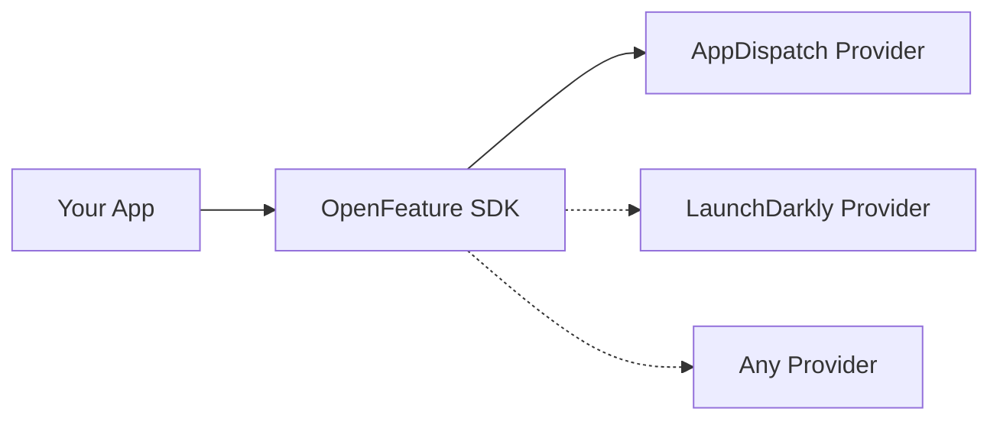
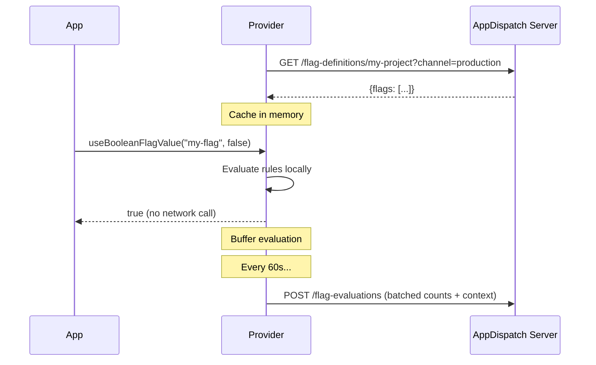

# OpenFeature Provider

AppDispatch implements the [OpenFeature](https://openfeature.dev) standard — an open, vendor-neutral API for feature flag evaluation. You get a standard interface that works across providers, and you can swap AppDispatch for any other OpenFeature-compatible provider without changing your application code.

## Why OpenFeature?

Most mobile feature flag tools use proprietary SDKs. If you switch providers, you rewrite every flag evaluation in your codebase. OpenFeature solves this with a standard API:

You write your flag evaluations once using the OpenFeature SDK. The provider handles the implementation details.

## Client-side evaluation

All evaluation happens on the device. The provider fetches a compact set of flag definitions (key, type, default value, rules, variations) and evaluates them locally.

### Deterministic rollouts

Percentage rollouts use FNV-1a hashing of `flagKey + targetingKey` to produce a stable bucket (0-99). The same user always gets the same result for the same flag, across sessions and devices.

## Evaluation reporting

The provider automatically reports flag evaluations back to AppDispatch for analytics. Evaluations are **batched in memory** and flushed every 60 seconds (configurable via `flushIntervalMs`). A final flush happens when the provider closes.

This powers the **Contexts** page and per-flag **evaluation charts** in the dashboard — showing which users evaluated which flags and how often.

No individual evaluation triggers a network call. If a flag is evaluated 1,000 times in a minute, one HTTP request is sent with the aggregated counts.
