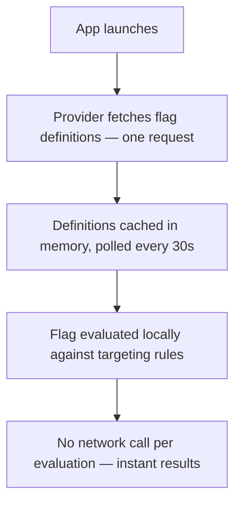

# Feature Flags

AppDispatch includes a built-in feature flag system that evaluates flags **on-device** with no per-evaluation network calls. Flags are fetched once on app launch and cached locally, then evaluated against targeting rules using the [OpenFeature](https://openfeature.dev) standard.



## Flag types

| Type | Example values | Use case |
|------|---------------|----------|
| `boolean` | `true`, `false` | Kill switches, feature toggles |
| `string` | `"variant-a"`, `"blue"` | A/B test variants, theme selection |
| `number` | `42`, `0.5` | Limits, thresholds, numeric configs |
| `json` | `{"maxRetries": 3}` | Complex configuration objects |

## Targeting rules

Rules control which users see which flag value. They're evaluated in **priority order** (lowest number first). The first matching rule wins.

### User list

Target specific users by ID:

```jsx
// Set evaluation context in your app
OpenFeature.setContext({ targetingKey: currentUser.id })
```

Users whose `targetingKey` matches the rule's user list receive the targeted variation.

### Percentage rollout

Gradually roll out to a percentage of users. Rollout is **deterministic** — a given user always gets the same result for the same flag, using FNV-1a hashing of `flagKey + targetingKey`.

### Attribute rules

Target users based on context attributes like plan, platform, app version, or any custom property:

```jsx
// Set rich context in your app
OpenFeature.setContext({
  targetingKey: currentUser.id,
  kind: 'user',
  name: currentUser.name,
  plan: 'pro',
  platform: Platform.OS,       // 'ios' or 'android'
  appVersion: '2.4.1',
  country: 'US',
})
```

Attribute rules support these operators:

| Operator | Description | Example |
|----------|-------------|---------|
| `eq` | Equals | `plan eq "pro"` |
| `neq` | Not equals | `plan neq "free"` |
| `in` | In list | `country in ["US", "CA", "GB"]` |
| `not_in` | Not in list | `country not_in ["CN"]` |
| `contains` | String contains | `email contains "@company.com"` |
| `starts_with` | String starts with | `email starts_with "admin"` |
| `ends_with` | String ends with | `email ends_with "@internal.co"` |
| `gt`, `gte`, `lt`, `lte` | Numeric comparison | `age gte 18` |
| `semver_gt`, `semver_gte`, `semver_lt`, `semver_lte` | Semver comparison | `appVersion semver_gte "2.0.0"` |
| `exists` | Attribute is present | `beta_tester exists` |
| `not_exists` | Attribute is absent | `legacy_flag not_exists` |

Multiple conditions in a rule are combined with AND — all must match.

### Segment rules

Target users who match a **segment** — a reusable set of conditions defined once and shared across flags. Instead of rebuilding "platform = iOS AND plan = pro" on every flag, create an "iOS Pro Users" segment and reference it.

Segment rules show the segment name, estimated device count, and a preview of the conditions. When the segment is updated, every flag referencing it picks up the change automatically.

See [Segments](/feature-flags/segments) for details on creating and managing segments.

### OTA update rules

Target devices based on their update state. This is unique to AppDispatch — because the same SDK handles both updates and flags, flag rules can reference what code is actually running on the device.

Three match modes are available:

**Runtime version** — Only evaluate for devices running a specific runtime version:

| Operator | Meaning |
|----------|---------|
| `≥` | Runtime version is at least this value |
| `>` | Runtime version is greater than this value |
| `≤` | Runtime version is at most this value |
| `<` | Runtime version is below this value |

This eliminates the most common feature flag failure: enabling a flag for users who don't have the code yet. If a flag requires code shipped in runtime version `49.0.0`, add a rule with `runtime version ≥ 49.0.0` and it's impossible for the flag to activate on an older build.

**Branch** — Target devices on a specific branch (e.g. `canary`, `staging`). Useful for enabling a flag only for devices receiving updates from a particular branch.

**Updated within** — Target devices that received an update within the last N days. Useful for features that depend on recent assets or for identifying stale clients.

### Priority

A typical setup:

| Priority | Rule | Purpose |
|----------|------|---------|
| 0 | User list: internal team | Always see new feature |
| 1 | OTA: runtime version ≥ 49.0.0 | Only devices with the code |
| 2 | Segment: "iOS Pro Users" | Reusable audience gets early access |
| 3 | Percentage rollout: 10% | Gradual rollout to everyone else |

Rules are evaluated top-to-bottom. The first match wins. In this example, the OTA rule at priority 1 acts as a gate — devices below runtime version 49 skip this rule and fall through to lower-priority rules or the default value.

## Variations

Flags can have multiple **variations** — named values that rules can return. For a boolean flag, you typically have `true` and `false`. For string flags, you can have as many as you need:

| Variation | Value | Use case |
|-----------|-------|----------|
| Control | `"checkout-v1"` | Original checkout |
| Variant A | `"checkout-v2"` | Single-page checkout |
| Variant B | `"checkout-v3"` | Checkout with progress bar |

Percentage rollout rules distribute users across variations with custom weights.

## Health & analytics

Every flag tracks health metrics per variation — error rate, crash-free percentage, and affected devices. The flag list surfaces issues at a glance: flags with degraded health show a badge with the worst variation and its error rate.

In the flag detail view, evaluation analytics show daily volume, per-variation breakdowns, and a time-series chart. The health panel compares variations side-by-side so you can see if one variation is performing worse than another.

See [Flag Health](/insights/flag-health) for the full breakdown, and [Telemetry](/insights) for cross-dimensional attribution across flags and updates.

## Per-environment settings

Flags can be configured independently per **channel** (environment). Enable a flag in staging while keeping it off in production, or set different default values per environment.

### Typical workflow

1. **Development** — Flag enabled, targeting all users
2. **Staging** — Flag enabled, targeting QA team via user list
3. **Production** — Flag enabled, 10% rollout, monitoring metrics
4. **Production** — Increase to 50%, then 100%
5. **All environments** — Remove the flag, clean up code

## Release flags

Flags can be **scoped to a release** instead of toggled globally. When you publish an update with a [rollout policy](/updates/rollout-policies), you can attach flags and set their target value — a boolean toggle, a specific string variation, a number, or a JSON object. The override is only active for devices that received that release. Everyone else sees the global flag state.

The rollout policy controls both the update delivery **and** the flag state. At 5% rollout, only those 5% of devices see the release flag value. Because flag state is tied to the release, rollback is graduated — you can [revert a single flag](/updates/rollout-policies#flag-level-rollback) while keeping the update deployed, roll back the entire release, or roll back an entire channel.

Flag evaluation order:

1. Is the device on a release that configures this flag? → Return the release's value
2. Otherwise → Evaluate global flag rules (targeting, percentage rollout, default)

Once a release reaches 100%, the release's job is done. From there, manage the flag through the normal Feature Flags UI — change variations, update targeting rules, or clean up the flag entirely.

See [Rollout Policies](/updates/rollout-policies#release-flags) for the full workflow, including multi-type examples and the release-to-global handoff pattern.

## Evaluation reasons

Each evaluation includes a `reason`:

| Reason | Meaning |
|--------|---------|
| `RELEASE_OVERRIDE` | Flag value set by a release the device is on |
| `DISABLED` | Flag is turned off |
| `DEFAULT` | No rules matched |
| `TARGETING_MATCH` | A user list or attribute rule matched |
| `SEGMENT_MATCH` | A segment rule matched |
| `SPLIT` | A percentage rollout rule determined the value |
| `ERROR` | Something went wrong |
