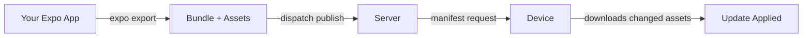

# Quickstart

Get from zero to shipping OTA updates in under 5 minutes.

## Prerequisites

- An Expo or React Native project
- A running AppDispatch server
- An API key (Settings → API Keys in the dashboard)

## 1. Install the CLI

See the [CLI reference](/cli) for platform-specific binaries, or on macOS:

```bash
curl -sL https://github.com/AppDispatch/cli/releases/latest/download/dispatch-darwin-arm64 \
  -o /usr/local/bin/dispatch && chmod +x /usr/local/bin/dispatch
```

## 2. Log in

```bash
dispatch login --key YOUR_API_KEY
```

## 3. Initialize your project

From your Expo project root:

```bash
dispatch init
```

Select your project, and the CLI will configure `app.json` automatically.

## 4. Publish your first update

```bash
dispatch publish -m "Initial release"
```

Your app will pick up the update on next launch.

## 5. Verify

Open your app on a device or simulator. On the next launch, `expo-updates` will fetch the new bundle from AppDispatch and apply it.

## What just happened?



## Next steps

- [Set up your first feature flag](/getting-started/first-flag)
- [Learn about channels and branches](/updates/channels)
- [Explore the SDK](/feature-flags/sdk)
