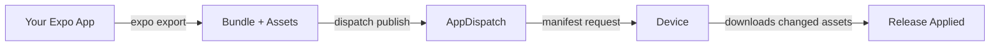

# Quickstart

Get from zero to shipping OTA updates in under 5 minutes.

## Prerequisites

- An Expo or React Native project
- An AppDispatch account and API key (Settings → API Keys in the dashboard)

## 1. Install the CLI

See the [CLI reference](/cli) for platform-specific binaries, or on macOS:

```bash
curl -sL https://github.com/AppDispatch/cli/releases/latest/download/dispatch-darwin-arm64 \
  -o /usr/local/bin/dispatch && chmod +x /usr/local/bin/dispatch
```

## 2. Log in

```bash
dispatch login --server https://api.appdispatch.com --key YOUR_API_KEY
```

## 3. Initialize your project

From your Expo project root:

```bash
dispatch init
```

Select your project, and the CLI will configure `app.json` automatically.

## 4. Install the SDK

```bash npm2yarn
npm install @appdispatch/react-native
```

## 5. Set up your app

Add the SDK to your root layout. `AppDispatch.init()` configures everything — OTA updates, feature flags, and health reporting — in one call:

```jsx filename="app/_layout.tsx"
import {
  AppDispatch,
  AppDispatchProvider,
  useOTAUpdates,
} from '@appdispatch/react-native'

AppDispatch.init({
  baseUrl: 'https://api.appdispatch.com',
  projectSlug: 'my-app',
  apiKey: 'YOUR_API_KEY',
  channel: 'production',
})

export default function RootLayout() {
  useOTAUpdates()

  return (
    <AppDispatchProvider>
      <YourApp />
    </AppDispatchProvider>
  )
}
```

- `AppDispatch.init()` — Initializes the OpenFeature provider and health reporter at module level
- `useOTAUpdates()` — Checks for updates on launch, generates a stable device ID for rollout bucketing, and applies critical updates immediately. No-ops in `__DEV__` mode.
- `AppDispatchProvider` — Wraps your app with the OpenFeature context and starts health monitoring

## 6. Publish your first release

```bash
dispatch publish -m "Initial release"
```

## 7. Verify

Open your app on a device or simulator. On the next launch, `expo-updates` will fetch the new bundle from AppDispatch and apply it.

## What just happened?



1. `dispatch publish` exported your app and uploaded the bundle
2. Your device's `useOTAUpdates` hook checked for a new manifest
3. Changed assets were downloaded and applied
4. On next launch, the new code runs

## Next steps

- [Set up your first feature flag](/getting-started/first-flag)
- [Learn about channels and branches](/updates/channels)
- [Explore the SDK](/feature-flags/sdk)
