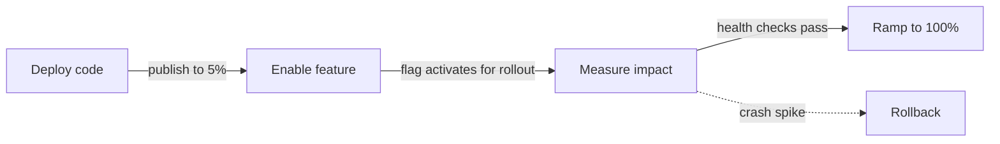

# AppDispatch

**Continuous delivery for Expo & React Native.**

Most mobile teams use three separate tools to ship safely: one for OTA updates, one for feature flags, and one for crash monitoring. When something breaks, you're left stitching together dashboards to figure out if it was the deploy or the flag. AppDispatch replaces all three with one platform — so deploying code, enabling features, measuring impact, and rolling back are a single workflow, not a juggling act.

```bash
# Push a release to 5% of production
$ dispatch publish --channel production --rollout 10 -m "New checkout flow"
```

Then link the `new-checkout` flag from the dashboard — it activates only for devices that received the release. AppDispatch tracks health automatically. If error rates spike, auto-rollback kicks in. If health gates pass, it ramps to 100%.

```jsx
import { useBooleanFlagValue } from '@appdispatch/react-native'

function CheckoutButton() {
  const newCheckout = useBooleanFlagValue('new-checkout', false)
  return newCheckout ? <NewCheckoutFlow /> : <LegacyCheckout />
}
```

The flag evaluates on-device with no network calls — and because it's linked to the release, it only returns `true` for devices that have the code.

---

## Get started in 5 minutes

import { Cards } from 'nextra/components'

<Cards>
  <Cards.Card title="Quickstart" href="/getting-started" />
  <Cards.Card title="Core Concepts" href="/concepts" />
  <Cards.Card title="OTA Releases" href="/updates" />
  <Cards.Card title="Feature Flags" href="/feature-flags" />
</Cards>

## One system, not three



With separate tools, each step is a manual handoff. With AppDispatch, they're wired together:

1. **Deploy code** — Push a release to a percentage of devices with `dispatch publish`
2. **Enable feature** — Linked flags activate only for devices that received the release
3. **Measure impact** — Crash rate and error rate are tracked per flag variation and release version automatically
4. **Ramp or rollback** — Rollout policies advance through stages when health thresholds pass. If metrics degrade, roll back a single flag, the entire release, or a whole channel.

Because AppDispatch owns the update pipeline, the flag evaluation, and the error collection, it knows which devices have which code **and** which flag state. That's what makes [cross-dimensional telemetry](/insights) possible — and why rollback can be surgical instead of all-or-nothing.

## The platform

- **OTA releases** — Push JavaScript bundles without app store review
- **Feature flags** — Toggle features per environment with [OpenFeature](https://openfeature.dev), evaluated on-device with no network calls
- **Linked flags** — Tie flag state to a release so features activate only for devices that have the code
- **Rollout policies** — Automate progressive deployments with health-based stage gates and auto-rollback
- **Channels & branches** — Route releases to production, staging, or any environment
- **Code-aware targeting** — Flag rules that reference runtime versions, so flags can't activate without the code
- **Graduated rollback** — Revert a single flag, an entire release, or a whole channel
- **Cross-dimensional telemetry** — Correlate crash spikes with specific flag variations and release versions automatically
