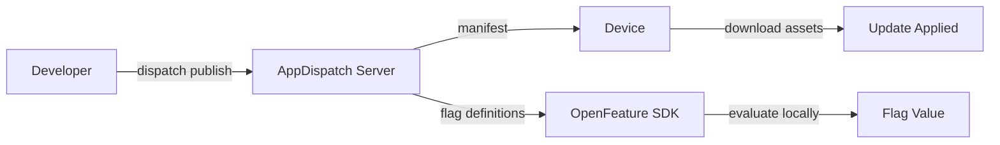

# AppDispatch

**Ship OTA updates and feature flags for Expo & React Native.**

AppDispatch delivers over-the-air updates and evaluates feature flags for Expo & React Native. Push updates instantly without app store review, control rollouts with channels, and toggle features per environment.

---

## Get started in 5 minutes

import { Cards } from 'nextra/components'

<Cards>
  <Cards.Card title="Quickstart" href="/getting-started" />
  <Cards.Card title="First Feature Flag" href="/getting-started/first-flag" />
  <Cards.Card title="OTA Updates" href="/updates" />
  <Cards.Card title="Feature Flags" href="/feature-flags" />
</Cards>

## How it works

1. **Push** — Export your Expo app and upload the bundle with the CLI
2. **Route** — Channels map to branches. Control which users get which update
3. **Ship** — Devices pull the latest manifest and download only changed assets
4. **Toggle** — Feature flags are fetched once and evaluated on-device with no network calls

## Key features

- **OTA updates** — Push JavaScript bundles without app store review
- **Channels & branches** — Route updates to production, staging, or any environment
- **Rollout policies** — Automate progressive rollouts with health-based stage gates
- **Feature flags** — Toggle features per environment with [OpenFeature](https://openfeature.dev)
- **Code-aware targeting** — Flag rules that know what runtime version is on the device, so flags can't activate without the code
- **Targeting rules** — Target specific users, attributes, or roll out by percentage
- **Graduated rollback** — Revert a single flag, an entire release, or a whole channel
- **Cross-dimensional telemetry** — Automatically correlate crash spikes with specific flag variations and update versions
