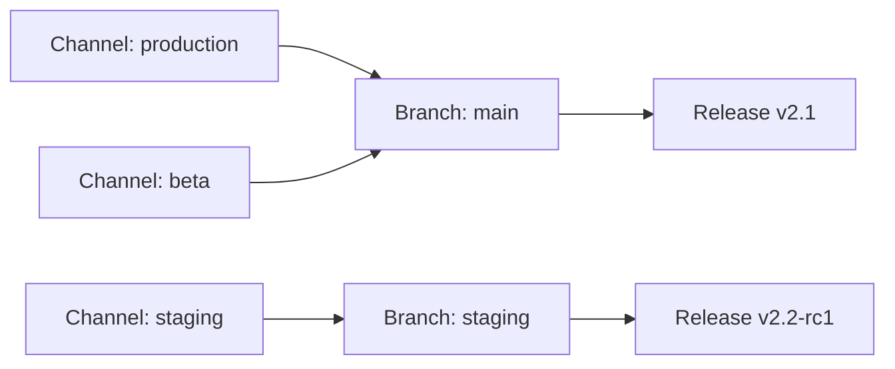

# Channels & Branches

Channels and branches control which releases reach which devices.

## How they relate

**Branch** — A named stream of releases. Each release is published to a branch.

**Channel** — What devices connect to. Each channel points to a branch. When a device requests the latest release for a channel, the server looks up the branch and returns the latest release on that branch.



Multiple channels can point to the same branch. This lets you "promote" a release by repointing a channel rather than re-publishing.

## Creating channels

Create channels from the dashboard or API:

```bash
curl -X POST https://api.appdispatch.com/v1/ota/channels \
  -H "Authorization: Bearer YOUR_API_KEY" \
  -H "X-Project: your-project-slug" \
  -H "Content-Type: application/json" \
  -d '{"name": "staging", "branchName": "staging"}'
```

## Creating branches

```bash
curl -X POST https://api.appdispatch.com/v1/ota/branches \
  -H "Authorization: Bearer YOUR_API_KEY" \
  -H "X-Project: your-project-slug" \
  -H "Content-Type: application/json" \
  -d '{"name": "staging"}'
```

## Percentage rollouts

Channels support **rollout branches** — serve a percentage of devices from a different branch. This is useful for canary deployments.

```bash
curl -X PATCH https://api.appdispatch.com/v1/ota/channels/production \
  -H "Authorization: Bearer YOUR_API_KEY" \
  -H "X-Project: your-project-slug" \
  -H "Content-Type: application/json" \
  -d '{
    "rolloutBranchName": "canary",
    "rolloutPercentage": 10
  }'
```

This sends 10% of devices to the `canary` branch while 90% stay on the channel's primary branch.

Rollout bucketing is **deterministic** — a given device always lands in the same bucket based on its device ID. This means a user won't flip between branches on successive launches.

## User overrides

Override specific users to receive releases from a different branch, regardless of their channel configuration:

```bash
curl -X POST https://api.appdispatch.com/v1/ota/user-overrides \
  -H "Authorization: Bearer YOUR_API_KEY" \
  -H "X-Project: your-project-slug" \
  -H "Content-Type: application/json" \
  -d '{"userId": "user-123", "branchName": "beta-testers"}'
```

User overrides take priority over channel rollout. This is useful for internal testing — point your team to a branch before releasing to everyone.

## Minimum runtime version

Channels can enforce a **minimum runtime version**. If a device's runtime version is below the minimum, the server tells the device to update via the app store instead of delivering an OTA release.

```bash
curl -X PATCH https://api.appdispatch.com/v1/ota/channels/production \
  -H "Authorization: Bearer YOUR_API_KEY" \
  -H "X-Project: your-project-slug" \
  -H "Content-Type: application/json" \
  -d '{"minRuntimeVersion": "2.0.0"}'
```

## How devices connect

Your `app.json` configures which channel the device uses:

```json
{
  "expo": {
    "updates": {
      "url": "https://api.appdispatch.com/v1/ota/manifest/your-project",
      "requestHeaders": {
        "expo-channel-name": "production"
      }
    }
  }
}
```

The device sends these headers on each manifest request:
- `expo-channel-name` — Which channel to check
- `expo-runtime-version` — The device's runtime version
- `expo-platform` — `ios` or `android`
- `expo-device-id` — Used for rollout bucketing
- `expo-user-id` — Used for user overrides and flag targeting
