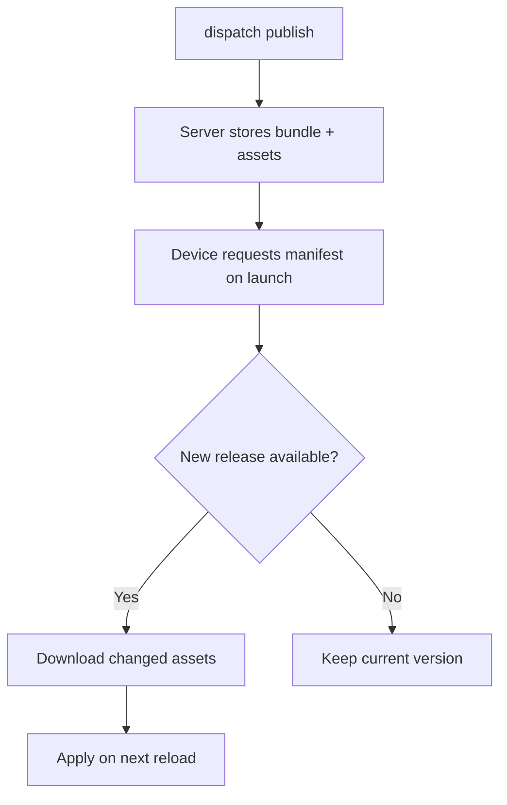
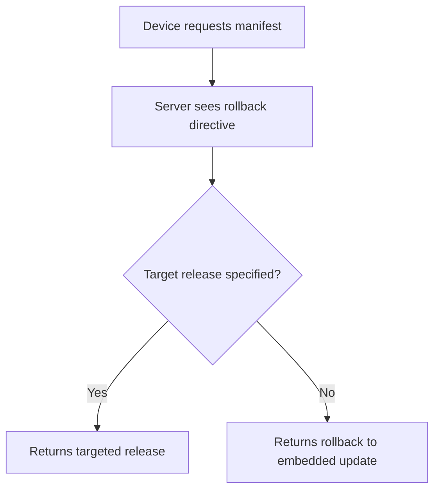

# How Releases Work

> **Terminology note:** AppDispatch refers to OTA updates as **releases** throughout the dashboard. The underlying mechanism is the standard Expo `expo-updates` OTA update system — "release" is the AppDispatch term for a published update bundle.

AppDispatch delivers over-the-air JavaScript bundle releases to your Expo and React Native apps without going through app store review.

## The release cycle

When you publish a release, the server stores your JavaScript bundle and assets. When a device launches your app, `expo-updates` requests the latest manifest. If there's a newer release, the device downloads the changed assets and applies it.



## Publishing

The fastest way to publish:

```bash
dispatch publish -m "Fix checkout button alignment"
```

See [`dispatch publish`](/cli/publish) for all options.

### Publish options

The dashboard publish flow is a two-step wizard with more options than the CLI shorthand:

- **Multi-channel publishing** — Publish the same build to multiple channels at once (e.g., staging and production).
- **Release notes** — Attach a human-readable message to the release.
- **Initial rollout percentage** — Set a per-release rollout slider (0–100%) controlling what percentage of devices receive this release.
- **Critical release** — Mark a release as critical (`isCritical`) to force an immediate app reload instead of waiting for the next cold start.
- **Rollout policy** — Select a rollout policy to automate staged rollout and auto-rollback.
- **Linked feature flags** — Attach feature flags to the release, with per-flag enable/disable or variation selection. Flags are toggled as the rollout progresses.

### With the API

Upload a build, then publish it:

```bash
# Upload
curl -X POST https://api.appdispatch.com/v1/ota/builds \
  -H "Authorization: Bearer YOUR_API_KEY" \
  -H "X-Project: your-project-slug" \
  -F "runtimeVersion=1.0.0" \
  -F "platform=ios" \
  -F "message=Deployed from CI" \
  -F "assets=@dist/bundles/ios.js"

# Publish
curl -X POST https://api.appdispatch.com/v1/ota/builds/42/publish \
  -H "Authorization: Bearer YOUR_API_KEY" \
  -H "X-Project: your-project-slug" \
  -H "Content-Type: application/json" \
  -d '{"channel": "production", "rolloutPercentage": 100, "isCritical": false, "releaseMessage": "Fix checkout button", "linkedFlags": []}'
```

## Multi-platform releases

The CLI automatically groups iOS and Android builds under a single `groupId`. With the API, pass the `groupId` from the first publish response to the second.

## Rollbacks

Create a rollback to revert devices to the embedded update, or target a specific prior release using `rollbackToUpdateId`:

```bash
# Rollback to embedded update
curl -X POST https://api.appdispatch.com/v1/ota/rollback \
  -H "Authorization: Bearer YOUR_API_KEY" \
  -H "X-Project: your-project-slug" \
  -H "Content-Type: application/json" \
  -d '{"runtimeVersion": "1.0.0", "platform": "ios", "channel": "production"}'

# Rollback to a specific release
curl -X POST https://api.appdispatch.com/v1/ota/rollback \
  -H "Authorization: Bearer YOUR_API_KEY" \
  -H "X-Project: your-project-slug" \
  -H "Content-Type: application/json" \
  -d '{"runtimeVersion": "1.0.0", "platform": "ios", "channel": "production", "rollbackToUpdateId": 42}'
```



Rollbacks are instant (no download needed when reverting to embedded), non-destructive (the old release is still stored), and per-platform.

### Per-release controls

Each release has individual controls available from the dashboard or API:

- **`isEnabled`** — Toggle a release on or off. Disabled releases are skipped by devices, effectively removing them from the channel without a full rollback.
- **`isCritical`** — When enabled, devices apply this release immediately on detection instead of waiting for the next cold start.
- **Rollout percentage** — A per-release slider (0–100%) controlling what fraction of devices receive this specific release.

When using [rollout policies](/updates/rollout-policies), rollback is graduated — you can revert a single linked flag, roll back the entire release, or roll back an entire channel. See [graduated rollback](/updates/rollout-policies#graduated-rollback) for details.

## Content-addressed storage

Assets are stored by their MD5 hash. Identical files across releases are never duplicated — uploads are fast and storage is efficient.

## Runtime versions

Each release is tagged with a **runtime version** fingerprint from your native dependencies. The server only delivers releases to devices with a matching runtime version. Changed native code requires an app store update.
