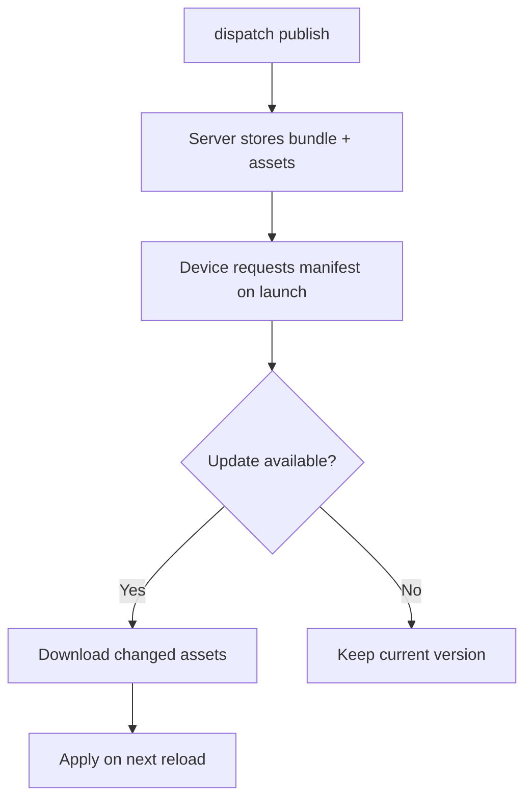
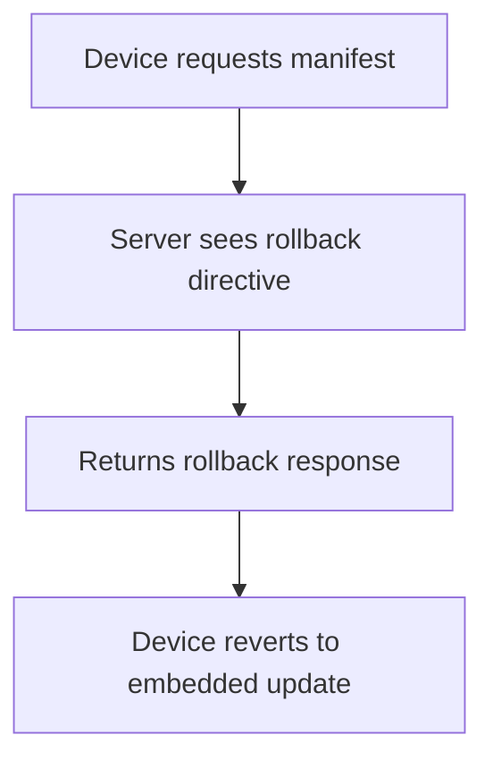

# How Updates Work

AppDispatch delivers over-the-air JavaScript bundle updates to your Expo and React Native apps without going through app store review.

## The update cycle

When you publish an update, the server stores your JavaScript bundle and assets. When a device launches your app, `expo-updates` requests the latest manifest. If there's a newer update, the device downloads the changed assets and applies it.



## Publishing

The fastest way to publish:

```bash
dispatch publish -m "Fix checkout button alignment"
```

See [`dispatch publish`](/cli/publish) for all options.

### With the API

Upload a build, then publish it:

```bash
# Upload
curl -X POST https://api.appdispatch.com/v1/ota/builds \
  -H "Authorization: Bearer YOUR_API_KEY" \
  -H "X-Project: your-project-slug" \
  -F "runtimeVersion=1.0.0" \
  -F "platform=ios" \
  -F "message=Deployed from CI" \
  -F "assets=@dist/bundles/ios.js"

# Publish
curl -X POST https://api.appdispatch.com/v1/ota/builds/42/publish \
  -H "Authorization: Bearer YOUR_API_KEY" \
  -H "X-Project: your-project-slug" \
  -H "Content-Type: application/json" \
  -d '{"channel": "production", "rolloutPercentage": 100}'
```

## Multi-platform releases

The CLI automatically groups iOS and Android builds under a single `groupId`. With the API, pass the `groupId` from the first publish response to the second.

## Rollbacks

Create a rollback to instantly revert devices to their embedded update:

```bash
curl -X POST https://api.appdispatch.com/v1/ota/rollback \
  -H "Authorization: Bearer YOUR_API_KEY" \
  -H "X-Project: your-project-slug" \
  -H "Content-Type: application/json" \
  -d '{"channelName": "production", "platform": "ios"}'
```



Rollbacks are instant (no download needed), non-destructive (the old update is still stored), and per-platform.

When using [rollout policies](/updates/rollout-policies), rollback is graduated — you can revert a single release flag, roll back the entire release, or roll back an entire channel. See [graduated rollback](/updates/rollout-policies#graduated-rollback) for details.

## Content-addressed storage

Assets are stored by their MD5 hash. Identical files across updates are never duplicated — uploads are fast and storage is efficient.

## Runtime versions

Each update is tagged with a **runtime version** fingerprint from your native dependencies. The server only delivers updates to devices with a matching runtime version. Changed native code requires an app store update.
