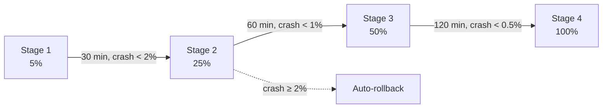
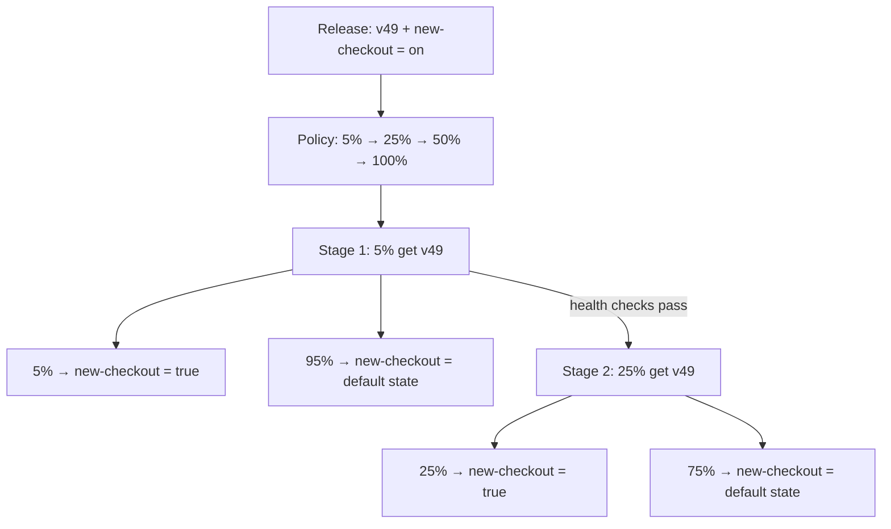
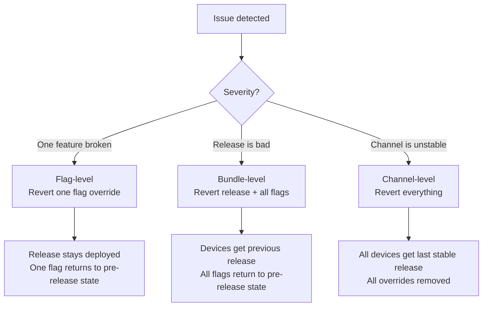

# Rollout Policies

Rollout policies automate progressive deployments. Instead of manually bumping rollout percentages and watching dashboards, you define a policy once and AppDispatch advances through stages automatically — or rolls back if health metrics degrade.

## How it works

A rollout policy is a reusable template of **stages**. Each stage defines:

- **Target percentage** — What percentage of devices receive the release at this stage
- **Wait time** — How long to observe before advancing
- **Minimum devices** — How many devices must receive the release before the stage is considered valid
- **Thresholds** — Health metrics that must stay within bounds

When you publish a release and attach a policy, AppDispatch creates an **execution** — a live instance of the policy running against that release. The execution advances through stages automatically when conditions are met, and halts or rolls back if they aren't.

## Stages

Stages run in order. Each stage holds at its target percentage until all advancement conditions are met:

| Condition | Purpose |
|-----------|---------|
| Wait time elapsed | Give the release time to soak |
| Minimum devices reached | Ensure enough data points for meaningful metrics |
| All thresholds passing | Health metrics are within acceptable bounds |

Once all conditions pass, the execution advances to the next stage. When the final stage completes, the rollout is marked as **completed** at 100%.

### Example: Safe Production Rollout

| Stage | Percentage | Wait | Min Devices | Thresholds |
|-------|-----------|------|-------------|------------|
| 1 | 5% | 30 min | 100 | Crash rate < 2%, JS error rate < 5% |
| 2 | 25% | 60 min | 500 | Crash rate < 1%, JS error rate < 3% |
| 3 | 50% | 120 min | 2,000 | Crash rate < 0.5%, JS error rate < 1% |
| 4 | 100% | — | — | — |

The final stage typically has no thresholds — by the time you've passed through 50% of devices, the release is proven safe.

## Thresholds

Each threshold monitors a health metric and defines what happens if the metric is violated:

| Metric | Description |
|--------|-------------|
| `crash_rate` | Percentage of sessions ending in a native crash |
| `js_error_rate` | Percentage of sessions with unhandled JS errors |

### Threshold actions

| Action | Behavior |
|--------|----------|
| **Gate** | Prevent advancement to the next stage. The rollout stays at its current percentage until the metric recovers. |
| **Auto-rollback** | Trigger a [bundle-level rollback](#bundle-level-rollback) — revert the release and all linked flag overrides. Devices receive the previous release and flags return to their pre-release state. |

A threshold configured as a gate gives you time to investigate before things get worse. A threshold configured as an auto-rollback acts as an automated safety net.

## Linked flags

When publishing a release, you can attach **linked feature flags** — flags whose state is scoped to the release rather than toggled globally. The rollout policy controls both the release delivery **and** the flag state for the devices it reaches.

This is the key distinction: linked flags are not global toggles. A flag linked to a release is only active for devices that received that release. Everyone else sees the default flag state.

### How evaluation works

When a device evaluates a flag, AppDispatch checks if the device is on a release that configures that flag. Linked flag overrides take precedence over the default flag state:

1. Is the device on a release that links this flag? → Return the release's target value
2. Otherwise → Evaluate normal flag rules

This means the release owns the state of that flag for its audience, regardless of the default configuration.

### All flag types

Linked flags work with every flag type, not just booleans:

| Flag type | What you configure | Example |
|-----------|-------------------|---------|
| `boolean` | Enable or Disable | `new-checkout` → Enable |
| `string` | A specific variation | `checkout-layout` → "Single Page" |
| `number` | A specific variation | `max-cart-items` → 50 |
| `json` | A specific variation | `checkout-config` → `{"maxRetries": 5}` |

For boolean flags, you toggle between Enable and Disable. For string, number, and JSON flags, you pick from the flag's defined [variations](/feature-flags#variations) — for example, choosing "Single Page" from a checkout layout flag with variations like "Single Page", "Multi Step", and "Accordion".

### Release-to-global handoff

The release handles the **deployment phase** — getting the code onto devices with a specific flag state. Once the rollout completes, flag management moves to the normal [Feature Flags](/feature-flags) workflow.

For example, using a string flag with lifecycle variations (`off`, `shadow`, `live`, `complete`):

1. Create flag `new-payment-engine` as a string type with variations: `off`, `shadow`, `live`, `complete`. Default: `off`
2. Ship a release with `new-payment-engine` → `shadow` and a rollout policy (5% → 25% → 100%)
3. As the rollout progresses, devices in each stage get the release **and** shadow mode — the new payment engine runs in the background, logging results against the old engine
4. Release hits 100% — every device has the code + shadow. The release's job is done
5. Go to Feature Flags, update the default value: `shadow` → `live` (new engine serves real results). Monitor. Then `live` → `complete` (remove old code path). Eventually clean up the flag

The release is responsible for atomic deploy + initial activation. Everything after that is the flag's own lifecycle, managed through the Feature Flags UI.

### Graduated rollback

Because linked flags tie flag state to the release, rollback isn't binary — you get three levels of response, from surgical to nuclear:

#### Flag-level rollback

Revert a single flag override while keeping the release deployed. Devices fall back to the pre-release flag state for that flag only.

Use this when a specific feature is causing issues but the rest of the release is fine. For example, if `new-checkout` is spiking errors but `redesigned-profile` is healthy, revert just `new-checkout` and keep everything else live.

#### Bundle-level rollback

Revert the entire release and remove all linked flag overrides. Devices receive the previous release, and all linked flags return to their pre-release state.

This is the standard rollback — equivalent to "undo this release." Automated threshold auto-rollbacks use this level.

#### Channel-level rollback

Revert **all active releases** on a channel. Every device on the channel receives the last stable release, and all linked flag overrides across all releases are removed.

This is the nuclear option for when multiple releases have compounding issues. It affects all users on the channel.

Each level has a confirmation dialog explaining the blast radius before you commit.

### Conflict warnings

The dashboard warns you when a linked flag configuration conflicts with the default state:

- **Redundant override** — A boolean flag is already enabled (or disabled) globally and the release override matches. The override has no additional effect. *"Already enabled for all users — this override has no additional effect."*
- **Partial rollout conflict** — A flag is already rolling out to some percentage of users globally. The release override takes precedence for devices in the release rollout, which may cause unexpected overlap. *"This flag is already rolling out to 25% of users. The release override will take precedence for devices in this rollout."*

For non-boolean flags, redundancy checks are skipped since you're picking a specific variation value that may differ from the global default.

The typical flow avoids conflicts entirely:

1. Create the flag — leave it globally **off** (or at its default variation)
2. Ship a release with the flag set to the desired value and a rollout policy
3. As the policy progresses, more devices get the flag via the release
4. At 100%, update the default flag value to match and remove the flag from future releases

### Linking flags to a release

In the publish flow, after selecting a channel and rollout policy, search and link feature flags. For each flag:

- **Boolean flags** show an Enable/Disable toggle
- **String, number, and JSON flags** show a dropdown of the flag's variations

The same device identity that determines the rollout bucket also determines the flag state, so bucketing is consistent across releases and flags.

## Executions

An execution is a live rollout in progress. The execution detail view streams updates in real time via Server-Sent Events (SSE), so stage transitions, metric changes, and auto-rollbacks appear instantly without refreshing. Each execution tracks:

- **Current stage and percentage** — Where the rollout is right now
- **Health metrics** — Live crash rate, JS error rate, app launches, unique devices
- **Linked flags** — Which flags are linked to this release and their target state
- **Audit log** — Every stage transition, pause, resume, and rollback with timestamps and reasons

### Execution statuses

| Status | Meaning |
|--------|---------|
| **Active** | Rollout is progressing through stages |
| **Paused** | Manually paused — won't advance until resumed |
| **Completed** | Reached 100% and all thresholds passed |
| **Rolled back** | A threshold violation triggered an auto-rollback |
| **Cancelled** | Manually cancelled before completion |

### Manual controls

Even with automated policies, you retain full control:

- **Pause** — Freeze at the current percentage while you investigate
- **Resume** — Continue advancing through stages
- **Advance** — Skip to the next stage (overrides wait time and thresholds)
- **Revert flag** — Remove a single linked flag override, keeping the release deployed
- **Roll back release** — Revert the release and all linked flag overrides
- **Roll back channel** — Revert all active releases on the channel

## Creating a policy

Policies are created from **Rollouts → Policies** in the dashboard. Define:

1. **Name and description** — e.g. "Safe Production Rollout"
2. **Channel** — Which channel this policy applies to
3. **Stages** — Add stages with target percentages, wait times, and thresholds

Policies are reusable — create one policy per risk profile and apply it to any release.

Each policy has an **active/inactive toggle**. Inactive policies are hidden from the publish flow but remain available for re-activation.

You can **edit** or **delete** policies from the policy detail view. Editing is locked while an execution is running against the policy — pause or complete the execution first. Deleting a policy does not affect already-completed executions.

### Common policy patterns

**Canary release** — Start extremely small, then scale quickly:

| Stage | Percentage | Wait |
|-------|-----------|------|
| 1 | 1% | 15 min |
| 2 | 10% | 30 min |
| 3 | 50% | 60 min |
| 4 | 100% | — |

**Fast staging rollout** — Minimal gates for non-production:

| Stage | Percentage | Wait |
|-------|-----------|------|
| 1 | 50% | 10 min |
| 2 | 100% | — |

**High-risk production** — Extra conservative for critical apps:

| Stage | Percentage | Wait | Min Devices |
|-------|-----------|------|-------------|
| 1 | 1% | 60 min | 200 |
| 2 | 5% | 120 min | 1,000 |
| 3 | 25% | 240 min | 5,000 |
| 4 | 50% | 360 min | 10,000 |
| 5 | 100% | — | — |

## Rollout policies + linked flags + channels

These three systems work together:

1. **[Channels](/updates/channels)** route devices to branches and handle deterministic bucketing
2. **[Feature flags](/feature-flags)** control feature visibility — globally or linked to a release
3. **Rollout policies** automate the progression and tie everything together

A typical workflow for a major feature launch:

1. Create a feature flag `new_checkout` — leave it globally **off**
2. Ship the code behind the flag in a build
3. Publish a new release with `new_checkout` → **Enable** and the "Safe Production Rollout" policy
4. Stage 1: 5% of devices get the release and `new_checkout = true`. The other 95% stay on the previous version with `new_checkout = false`
5. Health checks pass → Stage 2: 25% now have the release and the flag on
6. If crashes spike, the release rolls back — devices leave the release group and `new_checkout` falls back to its pre-release state (off)
7. At 100%, all devices have the flag via the release. Optionally flip the default value to **on** and remove the flag from future releases
